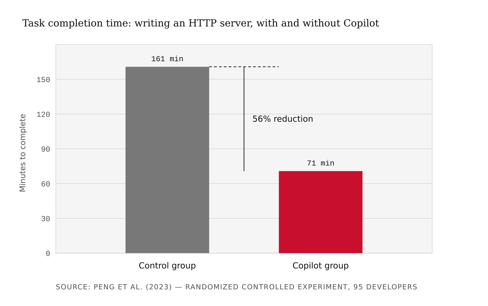
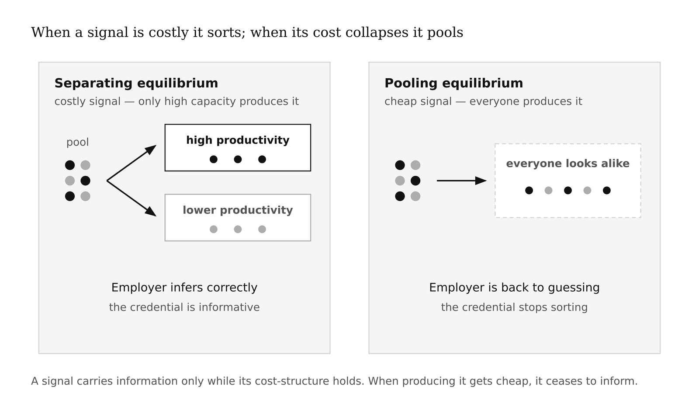
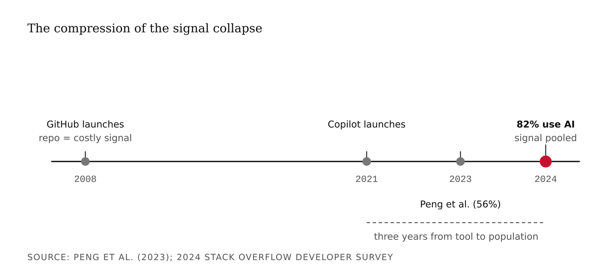
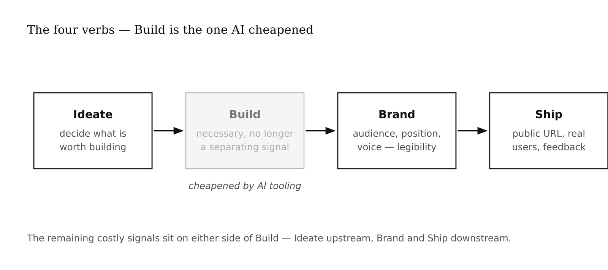
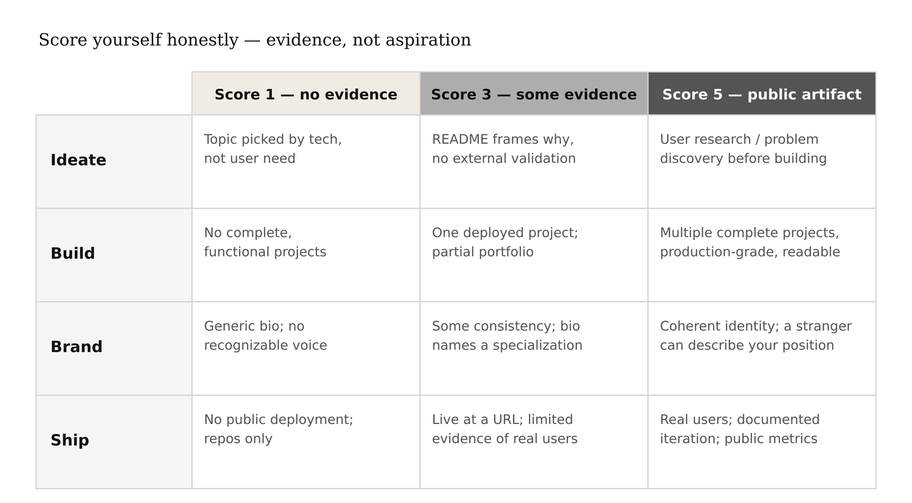
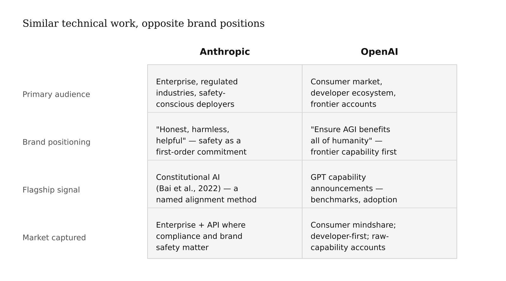
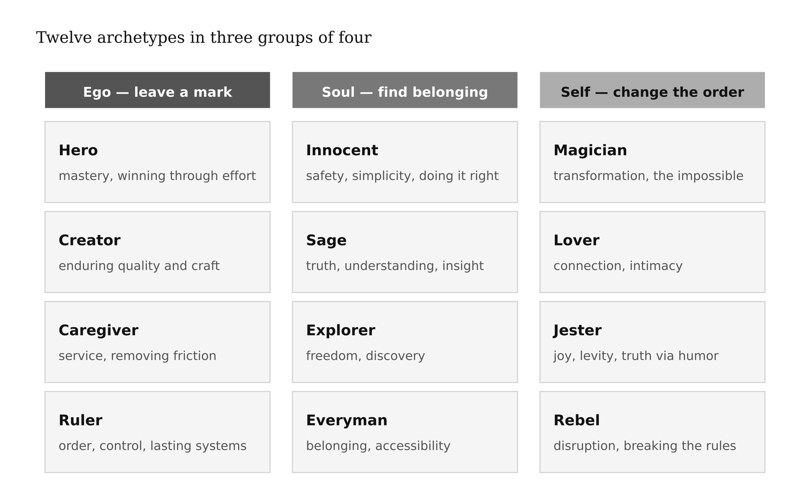
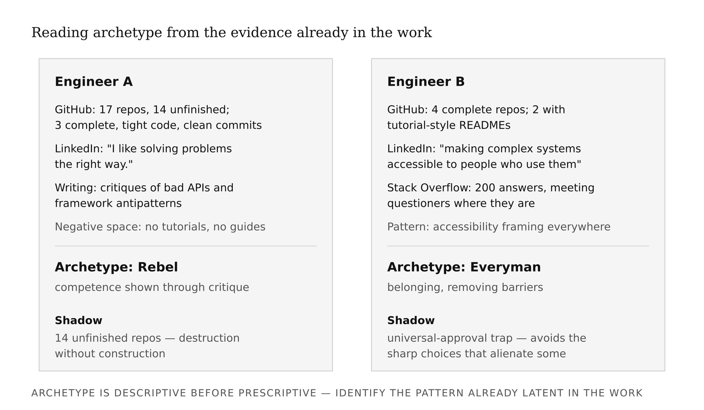
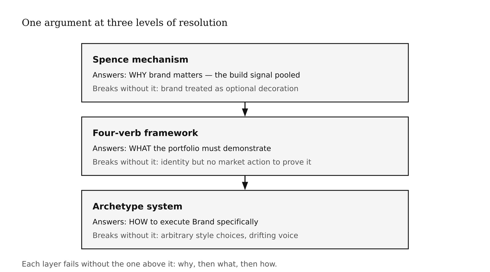

# Chapter 1 — The Creative Engineer
*When the cost of building collapses, the value of knowing what to build rises.*

> **TL;DR:** When AI makes software cheap to build, the value shifts to knowing *what* to build and being recognizable for it. This chapter uses a classic economics idea (costly signals) to explain why common tech credentials stopped setting people apart, then introduces the two tools the rest of the book runs on: the four-verb framework (Ideate, Build, Brand, Ship) and twelve brand archetypes.
>
> | Section | Preview |
> |---|---|
> | The Machinery: Spence's Signaling Mechanism | How an economics idea about costly signals explains why credentials like a CS degree stopped reliably setting candidates apart. |
> | The Four Verbs | The four kinds of work — Ideate, Build, Brand, Ship — that now carry career value, and how to score yourself honestly on each. |
> | The Twelve Archetypes | A set of twelve recognizable identities a brand can adopt to make its work legible to the people it is for. |
> | Three Frames, One Argument | Three different angles on the same shift, all converging on one claim about where professional value now sits. |

---

In 2022, a team of researchers at Microsoft Research ran a controlled experiment. They took ninety-five professional developers and gave them a single task: write an HTTP server in JavaScript. Half got nothing extra. Half got GitHub Copilot.

The control group finished in 161 minutes. The treatment group finished in 71 minutes.

That is a 56% reduction in task completion time. Not a rounding error. Not a startup press release. A peer-reviewed, randomized controlled experiment on professional developers doing real work.

Here is the reaction most people have: *"Great — engineers got more productive."*

Here is the question I want you to sit with instead: *what exactly got cheaper, and what does that do to the market?*

Those are different questions. The first is about individual performance. The second is about market structure. This chapter is about the second question, and to answer it properly I need to take you somewhere unexpected: a 1973 paper in labor economics that has almost nothing to do with software and almost everything to do with your career.



*Figure 1.1 — Task completion time, Peng et al. (2023)*

<!-- → [CHART: Bar chart — Control Group (161 min) vs. Copilot Group (71 min) with 56% reduction labeled prominently; helps anchor the empirical claim before signaling theory is introduced] -->

---

## The Machinery: Spence's Signaling Mechanism

Michael Spence had a problem to solve. Employers want to hire productive workers. But productivity is not directly observable — you cannot measure it without actually doing the job, and by the time you have measured it, you have already made the hire. So employers use *signals*: things candidates show or do that correlate with the thing they cannot observe directly.

The canonical example is education. A college degree, in Spence's model, functions as a signal of productive capacity. Not because the courses necessarily produce the capacity — Spence was deliberately agnostic about whether education causes productivity — but because getting a degree is *costly*, and the cost is structured in a way that correlates with productive capacity. Less-capable candidates either do not enroll, do not finish, or take longer. The signal carries information *because it is hard to fake cheaply*.

Here is the part that took me a while to really absorb: **a signal works only as long as its cost-structure holds**. If the cost of producing the signal falls — if everyone can produce it easily — the signal stops sorting. It ceases to be informative. The employer is back to guessing.

Spence called the good state a *separating equilibrium*: signals successfully separate high-productivity candidates from lower-productivity ones. When the cost-structure collapses, you get a *pooling equilibrium* — everyone looks the same on the credential, and the credential stops doing its job.

<!-- → [INFOGRAPHIC: Two-column schematic — separating equilibrium (signal sorts high from low productivity) vs. pooling equilibrium (signal stops distinguishing); use simple candidate-pool diagrams with arrows showing employer inference] -->



*Figure 1.2 — Separating vs. pooling equilibrium*

For roughly twenty years, "I have a working app on GitHub" was a separating signal for software engineers. Think about what it actually cost to produce that signal in 2010. You needed to know version control, a language, a framework, a deployment environment. You needed to debug something that broke at 11pm. You needed to persist through the project long enough to have something worth showing. The entire effort might span six weekends of genuine work. That cost correlated with productive engineering capacity. Recruiters used GitHub the way they used GPA — as a noisy but real proxy.

Now apply the Peng et al. result. The activation cost of producing a working app has fallen by more than half for bounded tasks, and continues to fall. The 2024 Stack Overflow Developer Survey found 82% of developers using AI tools for code. These are not early adopters at the frontier. They are the population.

When 82% of developers are using AI assistance, a GitHub repository no longer tells a recruiter whether they are looking at someone who built the project over six weekends of craft or someone who scaffolded it in a Tuesday afternoon with an LLM. The signal did not vanish. It *pooled*. Everyone produces it, so it stops sorting.



*Figure 1.3 — The compression of the signal collapse*

<!-- → [CHART: Timeline — 2004 (GitHub launches), 2021 (Copilot launches), 2023 (Peng et al. study published), 2024 (82% Stack Overflow survey); shows how fast the collapse compressed] -->

The question that follows from the mechanism is unavoidable: what is still costly after AI tooling?

Not writing the code — not in the way it used to be. Production-grade systems still require deep technical judgment. The 56% reduction was on a specific, bounded task; the judgment required to architect a system that scales, that doesn't leak credentials, that survives the edge cases real users will find — that has not been automated. But the *threshold* work, the work that used to be the demonstration, has cheapened substantially. What has not cheapened is identifying a problem worth solving, positioning a solution for a specific audience, and shipping to real users with real feedback loops. These require human contact with reality. They cannot be prompted away.

The labor-market evidence is consistent. Recent analyses of AI engineering salaries report base compensation averaging around $206,000, with specialists pulling 30–50% above generalists at the same seniority level. The market is repricing. The new separating signals are the ones AI tooling did not make cheap.

---

## The Four Verbs

I use the term *Creative Engineer* throughout this book. Let me specify what it means, because terms like this usually do too many jobs at once.

The Creative Engineer is an engineer who has noticed that the costly signals have shifted, and has invested accordingly. The framework has four verbs: **Ideate. Build. Brand. Ship.**

<!-- → [INFOGRAPHIC: Four-verb sequence — Ideate → Build → Brand → Ship — with Build visually de-emphasized or marked as "cheapened" to show where the signal collapse occurred] -->



*Figure 1.4 — The four verbs of the Creative Engineer*

**Ideate** is the hardest move, and the one generative AI cannot yet do for you. Generative tools are excellent at producing solutions. Given a specification, they will build it. What they cannot do is decide whether the specification is worth building. Talking to potential users, finding a real gap, refusing to build the wrong thing — this requires human judgment operating in the world. The failure mode I see most often: students pick a technology they want to learn, build a project around the technology, and then try to retrofit a user need onto the artifact. The result is a technically competent thing that nobody wanted. The project demonstrates Build. It does not demonstrate Ideate.

**Build** is the verb AI cheapened. The critical distinction: production-grade systems still require deep technical judgment. The point is that *demonstrating* Build through a GitHub repository has stopped being a separating signal. Build is necessary. It is not sufficient.

**Brand** is where the most resistance lives among technically trained students. In this book, Brand means something specific: the decisions — about audience, positioning, archetype, voice, and visual identity — that determine whether a stranger in your target audience can find your work and recognize why it is for them. The engineering analogy: an API without documentation is technically complete. It does the computation. It returns the right values. But if the developer who needs it cannot understand what it is for, it is useless. Documentation is not decoration on the API — it is the part that makes the API connectable to the world that needs it. Brand is documentation for your career. The common objection is that your work should speak for itself. The honest response: your work cannot speak at all if the person it is for cannot find it.

**Ship** means a public URL, an audience that found it, feedback from real use. Not committed to GitHub. Not published as a paper. Not demoed in class. Ship is what makes the difference — and it generates the most learning, because every assumption you made during Ideate and Build gets tested when real users encounter the thing.

| Verb | Score 1 — no evidence | Score 3 — some evidence | Score 5 — clear public artifact |
|---|---|---|---|
| **Ideate** | Project topics chosen by technology or assignment, not user need; no documented problem discovery | README or write-up frames why the project exists, but not tied to external validation or user contact | Public artifact showing user research, gap identification, or problem discovery before building (interview notes, problem statement, iteration log) |
| **Build** | No complete, functional projects in any public repository | At least one complete, deployed project; partial portfolio with some finished work alongside abandoned repos | Multiple complete projects with documented technical decisions; production-grade deployment visible; code is readable by a stranger |
| **Brand** | No consistent positioning; bio is generic or absent; no recognizable voice or audience across artifacts | Some consistency in tone or topic area; bio names a specialization; writing samples suggest an emerging voice | Coherent public identity across platforms; a specific audience is identifiable from the work; a stranger could describe your positioning without prompting |
| **Ship** | No public-facing deployment; projects exist only as repos or class submissions | At least one project live at a public URL; limited evidence of actual users beyond the builder | Deployed product with real users; documented iteration based on use; public metrics, testimonials, or engagement visible |



*Figure 1.5 — The four-verb scoring rubric*

<!-- → [TABLE: Four-verb scoring rubric — placed immediately after the verb definitions so readers can self-assess before moving to archetypes] -->

Consider Anthropic and OpenAI as a firm-level illustration. Both train large language models. Both were founded by technically excellent people with overlapping backgrounds — Anthropic was started in 2021 by former OpenAI researchers. The technical foundations are not radically different; both labs publish frontier research, both hit competitive capability benchmarks.

What is radically different is Brand.

In December 2022, Anthropic published Bai et al., "Constitutional AI: Harmlessness from AI Feedback" — a training method in which the model is guided by a written set of principles and trained to critique and revise its own outputs against those principles. This is a methodological contribution. It is also, and not by accident, a brand contribution. Anthropic chose to name a specific technical commitment to safety as the front door of their public identity. OpenAI's positioning chose differently: frontier capability first, moving fast, betting on AGI proximity as the primary signal. Two companies, similar technical work, very different market positions. Brand carved out two audiences that could each sustain a viable company.

| | **Anthropic** | **OpenAI** |
|---|---|---|
| **Primary audience** | Enterprise buyers, regulated industries, safety-conscious deployers | Consumer market, developer ecosystem, frontier-capability accounts |
| **Brand positioning** | "Honest, harmless, helpful" — safety as a first-order commitment | "Ensure AGI benefits all of humanity" — frontier capability first |
| **Flagship signal** | Constitutional AI (Bai et al., 2022) — a published, named method for value alignment | GPT capability announcements — benchmark performance and consumer adoption as primary signals |
| **Market captured** | Enterprise and API accounts where compliance and brand safety matter | Consumer mindshare; developer-first integrations; raw-capability accounts |

<!-- → [TABLE: Anthropic vs. OpenAI brand differentiation — audience, positioning, flagship signal, market captured; placed here to anchor the firm-level illustration before returning to individual career strategy] -->



*Figure 1.6 — Anthropic / OpenAI brand differentiation*

The same mechanism — explicit audience, differentiated positioning, chosen archetype — determines which slice of the market can recognize you, want you, and hire you. Not a company. A career.

---

## The Twelve Archetypes

We have established that Build has cheapened, and that Ideate, Brand, and Ship are the remaining costly signals. We have established that Brand means choosing an audience, a position, and a voice. Now the question is: *how do you choose?*

The framework I use throughout this book is the twelve Jungian archetypes as a strategic positioning system. Carl Jung proposed that certain recurring character patterns appear across cultures and myths — that the Hero, the Sage, the Trickster, the Caregiver are not inventions of specific cultures but structures of how humans organize meaning around persons and roles. Brand strategists Margaret Mark and Carol Pearson adapted this into a twelve-archetype model in their 2001 book *The Hero and the Outlaw*: Hero, Sage, Explorer, Innocent, Creator, Ruler, Caregiver, Magician, Lover, Jester, Everyman, Rebel.

The framework has two things going for it here. First, archetypes give you a vocabulary for the question you are actually trying to answer: *who am I to the people I am trying to reach?* Not "what can I do" — that is skill. But "what role do I occupy in their story?" An advisor. A challenger. A builder. A guide. This is a different and harder question, and the archetype framework forces you to answer it.

Second, the twelve are internally coherent — each comes with a shadow, a failure mode that is specifically the archetype's strength taken too far. The Hero's shadow is recklessness. The Sage's shadow is paralysis-by-analysis. The Creator's shadow is perfectionism that never ships. These shadows are predictive: once you identify your archetype, the shadow tells you which failure mode to watch for.

What the framework does *not* do: it does not tell you which archetype to choose. That choice requires evidence from your actual work, your actual voice, your actual patterns. The archetype is descriptive before it is prescriptive. You are not inventing a persona. You are identifying one that is already latent in how you work and communicate.

> **Exercise — Find Your Archetype**
> Before reading further, take the five-question quiz. It maps your work style, motivation, and fears to one of the twelve archetypes. Hold your result lightly — treat it as a hypothesis to test against the rest of this chapter.
> [→ Find Your Archetype quiz](../../INFO7375-BrutalistSummer2026/Week%201/week01-find-your-archetype/find-your-archetype.html)

| Archetype | Core drive | Signature phrase | Shadow failure mode |
|---|---|---|---|
| **Hero** | Mastery and winning through effort | "I'll find a way to win." | Recklessness dressed as determination |
| **Sage** | Understanding, truth, and the sharing of insight | "Let me show you how this actually works." | Analysis without action |
| **Explorer** | Freedom, discovery, and the avoidance of constraint | "There's something better out there." | Seventeen unfinished repositories |
| **Innocent** | Safety, simplicity, and doing things the right way | "If we just do this right, it will work out." | Naivety as comfort |
| **Creator** | Making things of enduring quality and craft | "It's not ready yet." | Perfectionism that never ships |
| **Ruler** | Order, control, and the building of lasting systems | "Here's how this should be structured." | Rigidity over responsiveness |
| **Caregiver** | Service and the removal of friction for others | "What do you need right now?" | Martyrdom as identity |
| **Magician** | Transformation and making the impossible possible | "What if we changed the frame entirely?" | Transformation as self-aggrandizement |
| **Lover** | Connection, intimacy, and specificity of address | "This is made for you, specifically." | Losing distinctiveness to avoid rejection |
| **Jester** | Joy, levity, and using humor to reveal truth | "Can't we see how absurd this is?" | Humor as deflection from accountability |
| **Everyman** | Belonging and making complexity accessible to all | "Anyone can do this — let me show you." | Populism over precision |
| **Rebel** | Disruption and breaking rules that deserve breaking | "That rule deserves to be broken." | Nihilism without a next move |

<!-- → [INFOGRAPHIC: Twelve-archetype wheel arranged in three groups of four — ego-driven, soul-driven, self-driven — with shadow failure mode visible for each; readers use this to locate their provisional archetype] -->



*Figure 1.7 — The twelve archetypes, grouped by orientation*

Here is the method for reading yourself into the framework. It is evidence-based, not introspective — you are not trying to decide what you wish you were. You are looking at the work you have already produced and finding the pattern.

Read your public writing. LinkedIn bio, GitHub readme, any technical writing you have published. What tone shows up? Are you teaching, demonstrating, provoking, synthesizing, building, advising? The archetype is audible in the voice before it is legible in the content.

Look at the projects you chose — not what you built for class, but what you built because you wanted to. Project choices reveal motivation. Did you build something to help a specific person? To demonstrate a capability? To solve a problem that annoyed you? To make something beautiful? Each of those is a different archetype at work.

Find the negative space. What do you *not* do in your public artifacts? The Sage typically does not post hot takes. The Rebel rarely posts polished tutorials. The Creator rarely writes about process; they show output. What is absent tells you as much as what is present.

Name the shadow. Once you have a provisional archetype, look for it in your own work history. Have you held onto a project past the point of useful revision because it was not perfect yet? (Creator shadow.) Have you analyzed a decision so thoroughly that the window for making it closed? (Sage shadow.) Have you picked up a new framework every six months without finishing anything in the last one? (Explorer shadow.)

To make this concrete: consider two engineers. Engineer A has a GitHub with seventeen repositories, fourteen unfinished. The three that are complete are technically elegant — tight code, minimal features, clean commit messages. Her LinkedIn bio says "I like solving problems the right way." Her writing is full of posts critiquing poorly-designed APIs and framework antipatterns. She has never published a tutorial. Provisional archetype: Rebel. The pattern is legible — she is drawn to what is wrong and broken, demonstrates competence through critique, and the negative space confirms it: no teaching, no guides, nothing that positions her as a guide to others. Shadow: fourteen unfinished repositories. Breaking the wrong way of doing something is only half the job. A Rebel who never ships a replacement is a complaint, not a contribution.

Engineer B has four repositories, all complete. Two have README files that read like tutorials. His LinkedIn bio talks about "making complex systems accessible to people who need to use them." He has answered 200 Stack Overflow questions. Provisional archetype: Everyman. The disambiguation from Sage rests on the Stack Overflow evidence — he is meeting questioners where they are, not elevating them toward understanding. Shadow: the universal-approval trap. He may find it difficult to take an unpopular position, or to make the sharp choices that would serve some users well at the cost of alienating others.

| Evidence source | What it reveals | Archetype implication | Shadow to watch for |
|---|---|---|---|
| **Engineer A** — GitHub: seventeen repos, fourteen unfinished; three complete with tight code and clean commits. LinkedIn: "I like solving problems the right way." Writing: critiques of poorly-designed APIs; no tutorials. | Strong opinions about what is broken; competence shown through critique; absence of teaching confirms the pattern | **Rebel.** Motivated by identifying dysfunction and attacking it; voice is adversarial and diagnostic. | Fourteen unfinished repos: destruction without construction. Sharp critique that stops before follow-through. |
| **Engineer B** — GitHub: four complete repos; two with tutorial-style READMEs. LinkedIn: framing around accessibility. Stack Overflow: 200 answers. | Teaching impulse and accessibility framing consistent across every channel; meets people where they are | **Everyman.** Motivated by belonging and the removal of barriers; meets questioners at their level rather than instructing from above. | Universal-approval trap: difficulty making sharp choices that serve some users at the cost of alienating others. |

<!-- → [TABLE: Two engineer profiles read against the archetype framework — illustrates how evidence-based archetype identification works before readers apply it to themselves] -->



*Figure 1.8 — Two GitHub profiles, two archetypes*

---

## Three Frames, One Argument

The Spence mechanism, the four verbs, and the archetype system are not three independent frameworks. They are one argument at three levels of resolution.

The Spence mechanism explains *why* the market is shifting: the signal that used to work has pooled. The four verbs explain *what* the new costly signals are: Ideate, Brand, and Ship, built on a necessary Build foundation. The archetype system explains *how* to execute Brand specifically: by naming the role you occupy for your audience, making your positioning coherent, and building a portfolio that expresses a single legible identity rather than a collection of disconnected projects.

The connection between the four verbs and the archetype is this: Brand without archetype is a set of style decisions without a strategic foundation. Archetype without the four-verb framework is identity work without a market position. You need both. The archetype tells you *who you are* to your audience. The four-verb framework tells you *what you are doing* to demonstrate it.

And the Spence layer underneath both explains why any of this matters. If building were still a separating signal, you would not need Brand and you would not need archetype. You would just build more and better things, and the market would find you. The reason you need these additional layers is that the build signal has cheapened — which means the separation work has moved upstream and downstream of build, into Ideate and Brand and Ship.

<!-- → [INFOGRAPHIC: Three-level stack — Spence Mechanism (why the market is shifting) → Four-Verb Framework (what the new portfolio must demonstrate) → Archetype System (how to execute Brand); shows the logical dependency between the three frames] -->



*Figure 1.9 — Three frames, one argument*

| Framework | Question It Answers | What Breaks Without It |
|---|---|---|
| **Spence Mechanism** | *Why* brand matters at all in this market | The student treats brand as optional decoration — investing only in build, then wondering why the GitHub no longer separates them |
| **Four-Verb Framework** | *What* the portfolio must demonstrate | The student has identity but no market action — a clear sense of who they are with nothing in the world that proves it |
| **Archetype System** | *How* to execute Brand specifically | Brand decisions are arbitrary style choices with no strategic foundation; portfolio voice drifts and the audience cannot tell who the work is for |

<!-- → [TABLE: Three-framework dependency table — placed at the synthesis moment to show how each layer fails without the others] -->

---

## What Would Change My Mind

A controlled study showing that, after holding technical skill constant, brand-strategy and positioning skills do *not* predict career outcomes for AI engineers — that the market rewards only deep technical specialization. The data is not there yet in either direction. The bet here is that the current trajectory continues. That is a bet, not a proof.

## Still Puzzling

Why technically excellent practitioners refuse brand work even when shown the labor-market evidence. Some of it is identity — "I am an engineer, not a marketer." Some of it is sunk cost — years of training for signals that are now depreciating. But there is a third thing I do not fully understand: brand work feels like a *category violation* to technical practitioners in a way that project management does not. The violation feeling is real even when the resistance is unjustified. I suspect it has to do with the difference between making something and claiming something — and with a specific anxiety that claiming distorts or contaminates the making. That is worth more thought than I have given it here.

---

## AI Wayback Machine

The ideas in this chapter didn't appear from nowhere. **Erving Goffman** was a sociologist who argued that social life is staged. In *The Presentation of Self in Everyday Life* (1959) he treated people as performers managing the impressions others form of them — controlling what shows on the "front stage" and what stays in the "back stage" — and called the whole effort *impression management*. That is exactly the work this chapter names *Brand*: once the build signal pools and your code can no longer speak for itself, what separates you is the legible identity you present — the archetype you occupy in someone else's story. Goffman's point lands hard here: the performance is not deception layered over the "real" work; it is the part that makes the work recognizable to the audience it is for.


*Erving Goffman — the sociologist of self-presentation, whose "impression management" is what this chapter calls Brand.*

**Run this:**

```
Who was Erving Goffman, and how does his idea of "impression management" from The Presentation of Self in Everyday Life connect to this chapter's claim that Brand — the legible identity you present to an audience — becomes a costly signal once the build signal pools and your work can no longer speak for itself? Keep it to three paragraphs. End with the single most surprising thing about his career or ideas.
```

→ Search **"Erving Goffman"** on Wikipedia after you run this. See what the model got right, got wrong, or left out.

**Now make the prompt better.** Try one of these:

- Ask it to explain *impression management* and the front-stage / back-stage distinction in plain language, as if you've never read any sociology
- Ask it to map Goffman's front stage onto a GitHub profile and LinkedIn bio — what is being staged, and for whom?
- Add a constraint: "Answer as if you're writing the rationale for why curating a coherent public identity is not faking it but is the work that makes a portfolio legible"

What changes? What gets better? What gets worse?

---

## Exercises

### Warm-Up

**W1.** In two sentences, explain the Spence signaling mechanism to someone who has never taken economics. Then name one signal that has *not* been disrupted by AI tooling and explain why its cost-structure remains intact.
*(Tests signal mechanism comprehension — difficulty: low)*

**W2.** Score yourself on each of the four verbs — Ideate, Build, Brand, Ship — on a 1–5 scale. For each score, write one sentence justifying it with a specific piece of evidence from your public work (or the absence of such evidence). A score of 4 on Build with no deployed product is not valid — the score must reflect observable artifacts.
*(Tests four-verb framework self-application — difficulty: low)*

**W3.** From the twelve archetypes listed in this chapter, pick your provisional archetype and its runner-up. For each, name one piece of evidence from your public work that supports it and one piece that contradicts it.
*(Tests archetype identification from evidence — difficulty: low)*

---

### Application

**A1.** Find a software product you use regularly. Apply the four-verb framework: does the product demonstrate strong Ideate (was there clearly a real user problem)? Strong Brand (is the positioning coherent for a specific audience)? Strong Ship (is the feedback loop visible — do they iterate based on real use)? Write a 200-word assessment using specific evidence from the product itself, not from press coverage.
*(Forces four-verb translation to a product outside your own work — difficulty: medium)*

**A2.** Choose one of the twelve archetypes that is *not* your own. Describe what a GitHub profile, LinkedIn bio, and project portfolio would look like for an engineer operating from that archetype with full intentionality. What would the voice sound like? What would the project choices reveal? What negative space would you expect? (200–300 words.)
*(Builds archetype-reading fluency by constructing an unfamiliar case — difficulty: medium)*

**A3.** Return to the Peng et al. 56% result. Identify a *second* category of engineering work — beyond writing an HTTP server — where you would expect AI tooling to produce a similar reduction in task time. Then identify a category where you would expect little or no reduction. Explain the difference using the Spence framework: what is different about the cost-structures of the two categories?
*(Tests application of signaling theory to novel examples — difficulty: medium)*

**A4.** Read the Anthropic vs. OpenAI illustration in the chapter. Identify a second pair of companies — in any industry, not just AI — where two technically similar competitors produce significantly different market outcomes through brand differentiation. Name the audience each company claimed, the positioning strategy each used, and which four-verb gaps (if any) are visible in each company's public story.
*(Forces Brand analysis in a context not provided in the chapter — difficulty: medium)*

---

### Synthesis

**S1.** A classmate argues: "The Spence framework explains credential signaling in job markets, but it doesn't apply to entrepreneurship — if you're building a startup, investors care about traction, not signals." Write a 300-word response evaluating this argument. Is the claim correct? Partially correct? Where does the Spence mechanism apply to startup fundraising and where does it not?
*(Tests cross-concept reasoning — Spence mechanism under a challenging reframe — difficulty: high)*

**S2.** The four-verb framework places Brand as the third step. A product manager argues: "Brand should come first — you need to know your audience before you build, not after." Construct the strongest version of this argument. Then construct the strongest counterargument. Which do you find more persuasive, and why? (400 words.)
*(Tests whether the student can hold the framework in tension with a legitimate challenge — difficulty: high)*

---

### Challenge

**C1.** The chapter argues that Build has cheapened and that Ideate, Brand, and Ship remain costly signals. Design a counter-experiment: what evidence would convince you that the chapter's central bet is *wrong*? What data would you need to see, and where would you look for it? Be specific — name the study design, the population, the outcome variable, and the timeframe. (400–500 words.)
*(Open-ended — tests whether the student has genuinely internalized the argument or is just reciting it — difficulty: challenge)*

---

## AI+1 — Self-as-Project on Madison

**Project:** Self-as-Project — *your brand, end to end*
**This chapter adds:** a four-verb self-audit and a public-signal baseline for your brand.
**Madison recipe:** [`intelligence-agent`](../madison/recipes/intelligence-agent.md)

> The brand decision is yours; Madison drafts; you accept, reject, or revise. Treat every agent-generated claim or metric as a draft that needs an evidence check — that is the "+1."

### Exercise 1 — When to Use AI
- *Pull your public footprint — repos, posts, profiles, talks — into one table.* **Why it works:** reformatting; clerk work before judgment.
- *Draft the Ideate / Build / Brand / Ship scoring scaffold.* **Why it works:** drafting the structure you then fill with honest scores.
- *Surface which verb your evidence is thinnest on.* **Why it works:** pattern-spotting across artifacts you confirm.

**Tell:** you are using AI well when you can independently check the output.

### Exercise 2 — When NOT to Use AI
- *Assigning your final four-verb scores.* **Why it fails:** calibration gap — the model rewards activity over shipped artifacts.
- *Deciding which of your signals is genuinely hard to copy.* **Why it fails:** that is the strategic judgment the chapter trains.
- *Claiming a result or credential you cannot verify.* **Why it fails:** hallucination/inflation risk; an unverifiable claim is treated as false.

**Tell:** you've crossed the line when the model's output is your *reason* for a score, not a tool for reaching it.
**Series connection:** trains signal-honesty — refusing to let visible effort masquerade as a costly signal.

### Exercise 3 — Recipe Exercise
**Build:** a public-signal baseline for your brand. **Run:** [`intelligence-agent`](../madison/recipes/intelligence-agent.md) on your own name/handles. **Tool:** Claude (a Claude Project that holds your brand identity).

```
Using the Madison intelligence-agent recipe approach, assemble a public-signal
baseline for ME as a brand. I will paste my public footprint (profiles, repos,
posts) below. Do only this:
1. Summarize what my public signal currently says about each of the four verbs —
   Ideate, Build, Brand, Ship — citing the specific artifact for each claim.
2. Flag every claim you cannot tie to a linked artifact as [UNVERIFIED].
3. Name the one verb where my public evidence is weakest.
Invent nothing. No score is final — output is a draft for me to grade.

My footprint:
[PASTE LINKS / TEXT]
```
**Adapt:** for a startup brand (Ch 8b) swap "me" for the venture and its public surfaces.

### Exercise 4 — CLI Exercise
**Build:** a reproducible `your-brand/signal-baseline.md`. **Tool:** the bundled [`wrap-your-tool`](../madison/wrap-your-tool/) scaffold, or Claude Code.

```
Create your-brand/ if absent. Save my pasted footprint as your-brand/footprint.txt.
Produce your-brand/signal-baseline.md: a table (verb | evidence artifact | link |
status) plus a one-line "weakest verb" finding. Mark any row without a working link
[UNVERIFIED]. Do not invent links. Stop after writing the file.
```
**Inspect:** every link resolves; no aspirational rows pass as evidence.
**If it goes wrong:** the model fills gaps with plausible-sounding artifacts — delete any row you can't open.

### Exercise 5 — AI Validation Exercise
**Validate:** the signal baseline. Mark each Pass / Fail / Cannot-determine with one line of evidence:
- **Correctness:** does each verb claim point to a real, openable artifact?
- **Completeness:** all four verbs covered, each with a status?
- **Scope:** baseline only — no career advice smuggled in?
- **Brand-specific:** is the "weakest verb" finding supported by the absence of artifacts, not vibes?
- **Failure-mode (fluent-but-wrong):** open every linked artifact — does it say what the row claims? Treat any unverifiable link as nonexistent.

*Tags: creative-engineer · signaling-theory · spence-mechanism · four-verb-framework · jungian-archetypes · brand-strategy · AI-tooling · GitHub-Copilot · labor-market · portfolio · INFO-7375*
