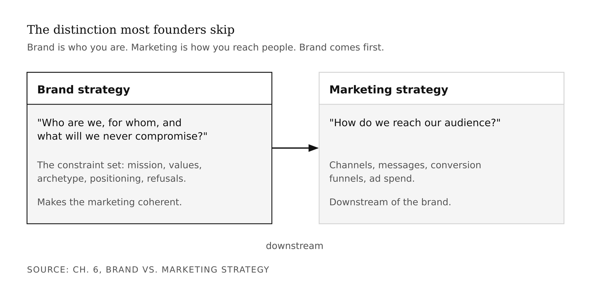
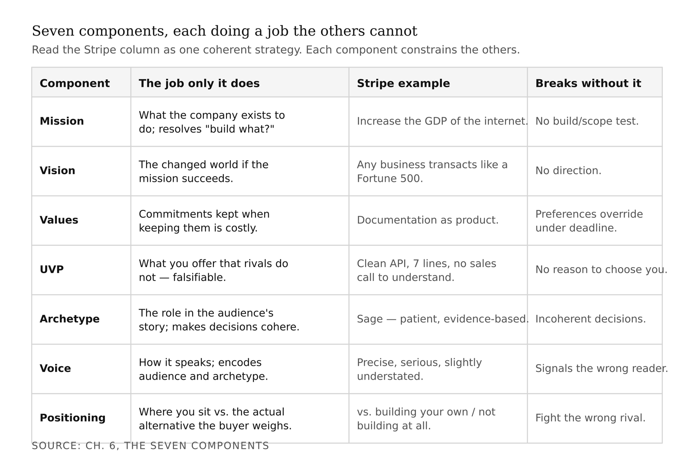
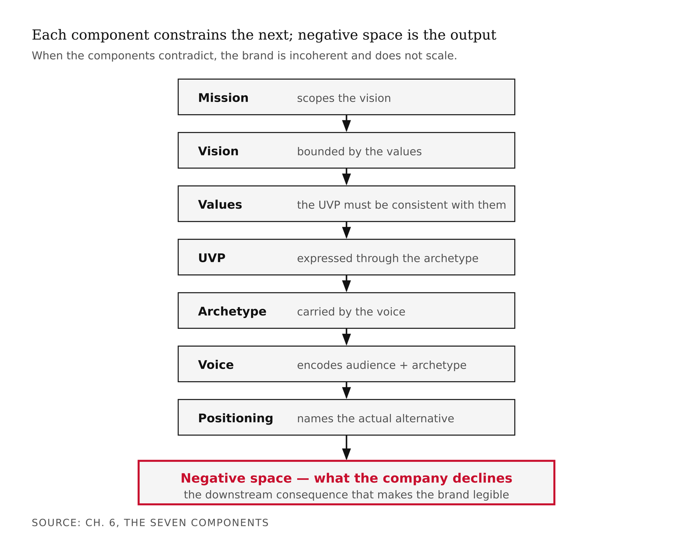
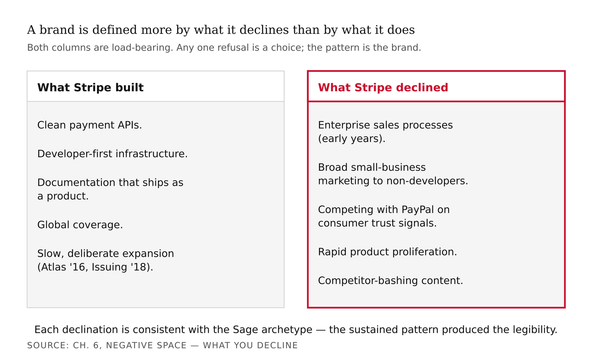
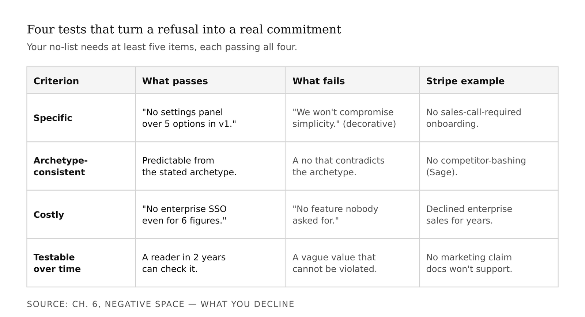
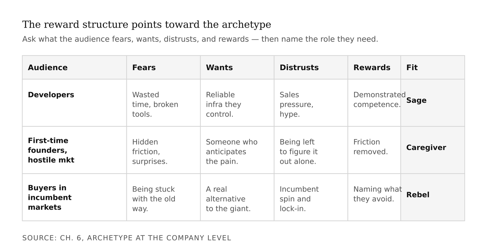
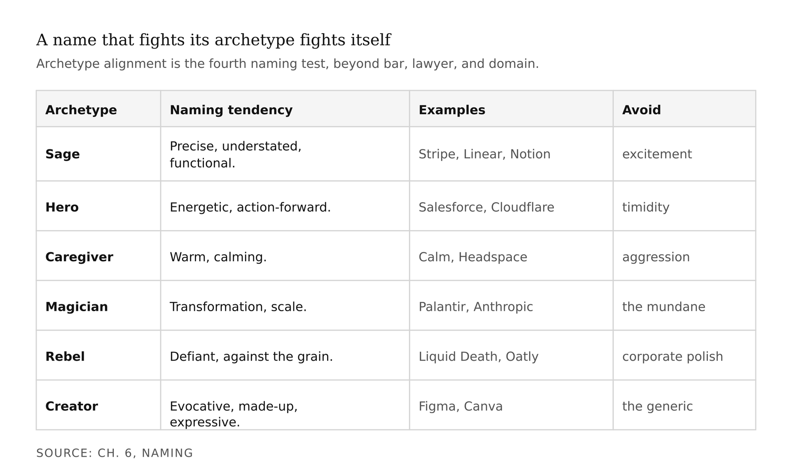
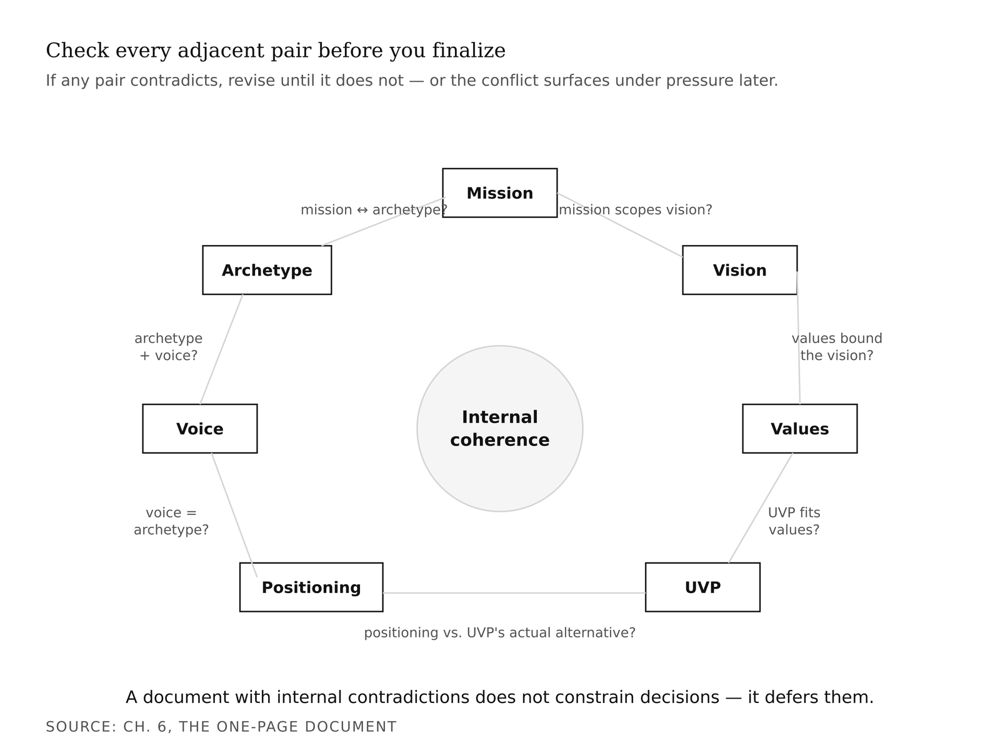

# Chapter 6 — Brand Strategy & Positioning
*The brand is not what you build. It is what you consistently decline to build.*

> **TL;DR:** A brand is defined less by what you build than by what you consistently decline to build. Using Stripe as the model, this chapter walks the seven components of a brand strategy and the "negative space" of deliberate refusals, then has you write a one-page strategy for your own venture.
>
> | Section | Preview |
> |---|---|
> | Brand vs. marketing strategy | The difference between who you are (brand) and how you reach people (marketing), and why brand comes first. |
> | The seven components | Mission, vision, values, value proposition, archetype, voice, and positioning — each with the job only it does. |
> | Negative space — what you decline | Why a brand's sustained refusals, more than its features, make it recognizable (the Stripe inversion). |
> | Archetype at the company level | How to pick the role your product's audience needs the company to play, and name its built-in failure mode. |
> | Naming | Three tests, plus archetype fit, for choosing a startup name you will not regret. |
> | The one-page document | Assembling the strategy on a single page and checking its parts do not contradict each other. |

---

Here is a test. Read Stripe's marketing site, their documentation, their blog, Patrick Collison's public writing, their API changelog. Then ask: what is Stripe's brand?

Most people answer by listing what Stripe does. Clean payment APIs. Developer-first infrastructure. Global coverage. Documentation that ships as a product. These are real. But they are the wrong answer, because they describe output. What makes a brand legible across fifteen years and a dozen product lines is not what a company consistently produces. It is what a company consistently *declines* to produce.

Stripe declined enterprise sales processes for the first several years. Declined broad-audience marketing. Declined rapid product proliferation. Declined competitor-bashing content. Declined to ship features before the documentation was done. Pile those refusals on top of each other over fifteen years and you get a company that looks, from the outside, as if it always knew what it was. When in fact it looks that way precisely because it kept declining the things that would have made it look like something else.

That mechanism — brand as sustained constraint, not accumulated output — is what this chapter is about.

You have spent several chapters building a tool. The pipeline runs. The AI layer produces output. The interface makes it usable. Now the question is whether there is a *company* behind it. A company is not a legal entity and a bank account, though you will eventually need both. A company is a system of decisions about what to build, what to decline, who to serve, how to speak, what to refuse. The brand strategy is the document that makes those decisions explicit before you are forced to make them under pressure.

Every startup makes brand decisions. Most make them reactively — when the first journalist asks "how would you describe what you do?", when the first enterprise customer asks for a feature that contradicts the original design, when the first competitor enters and someone asks "how are you different?" The companies that navigate those moments well made the decisions *in advance*, when the reasoning was clear and the pressure was low.

One prerequisite: your archetype from the opening chapters — the role you play in the story of the people you serve — gets applied here at the company level rather than the personal level. That distinction matters and I will come back to it.

---

Start with the distinction most people skip.

A marketing strategy answers: *how do we reach our audience?* Channels, messages, conversion funnels, ad spend. It is downstream of the brand.

A brand strategy answers: *who are we, for whom, and what will we never compromise?* It is the constraint set that makes the marketing strategy coherent. Without it, marketing decisions are made in isolation — the ad targets everyone, the message says nothing specific, the product ships features for every customer who asks. The company loses shape as it grows.



Seven components, each doing a job the others cannot.

**Mission** is what the company exists to do. One sentence, specific and testable. *Increase the GDP of the internet* is testable: you could, in principle, measure it. *Make payments easier* is not — easier than what, for whom, by how much? The mission's job is to resolve ambiguity when the team faces a decision about what to build next. If a proposed feature increases the GDP of the internet, build it. The mission should also be technology-agnostic: if payment APIs eventually become a commoditized input, the mission survives.

**Vision** is the world if you succeed. One or two sentences describing the specific changed state the mission would produce after ten or twenty years of effective pursuit. Stripe's implicit vision: every business anywhere in the world, regardless of size or location, can transact online with the same reliability and cost structure as a Fortune 500 company. Ambitious enough to be motivating; specific enough to be directional. "Change the world" is neither.

**Values** are the commitments the company maintains when maintaining them is costly. That last clause is the entire test. A value that has never cost you anything is not a value — it is a preference waiting to be overridden by the first deadline. *Documentation as product* is a Stripe value because Stripe has declined to ship features until the documentation was done, even when that delayed the release. The test for your values: for each one, name two specific decisions the company would make differently from a competitor with different values. If you cannot, the value is decoration.

**UVP** — Unique Value Proposition — is what your product offers that competitors do not, in one sentence specific enough that a customer could verify or falsify it. Stripe's at launch: the cleanest payment API available, integrable in seven lines of code, with documentation that did not require a sales call to understand. Each element is specific. "Cleanest" is a measurable quality. "Seven lines" is a count. "No sales call" is a fact. Every claim could be checked. Your UVP should have the same property: falsifiable, not just aspirational.

**Archetype** is the strategic anchor — the role the company plays in its audience's story. Stripe is a Sage: patient, evidence-based, rewards depth over breadth, speaks precisely. The archetype does not determine what you decide; it determines that your decisions cohere. A Sage company declines flashy feature announcements, declines competitor-bashing content, declines marketing that claims more than the documentation supports — not because someone drafted a policy, but because these are predictable expressions of the same underlying orientation. More on applying archetype at the company level shortly.

**Voice** is how the company speaks: sentence rhythm, vocabulary, formats favored and rejected. Most founders treat this as aesthetic preference and neglect to make it explicit. It is not aesthetic preference. Stripe's voice — precise, intellectually serious, slightly understated — signals that the intended reader has technical depth. A voice that over-explains signals a different audience. A voice with exclamation marks signals a different archetype. Voice encodes audience and archetype simultaneously, which is why it needs to be explicit rather than emergent.

**Positioning** is where the company sits relative to competitors, substitutes, and — most importantly — the *actual* alternatives the customer considers. This last part is where most founders go wrong. For Stripe in 2010, the actual alternative was not PayPal; it was *writing your own payment integration* or *not building the feature that required payments at all*. Positioning against the actual alternative produces a completely different strategy than positioning against a named competitor.



Each component constrains the others. The mission defines the scope of the vision. The values define what the company will not do to achieve the vision. The UVP defines what the product does that competitors will not, and should be consistent with the values. The archetype defines how all of it is expressed, consistent with the voice. The positioning defines who the audience is, consistent with the archetype. When the components contradict each other — mission broad but UVP narrow, archetype Sage but voice aggressive, positioning "for everyone" but values implying deep specialization — the brand is incoherent. Incoherent brands do not scale. Every new decision forces a choice between contradictory commitments.

The document this chapter asks you to produce is one page. One page is a constraint, not a convenience. If your strategy does not fit on one page, you have not made enough decisions. You are still listing options rather than committing to positions.



---

Now the mechanism most brand frameworks omit.

A brand is more defined by what it declines than by what it does. This is counterintuitive because companies produce artifacts — products, features, content — and it is natural to identify a brand with its output. But what separates a legible brand from an incoherent one is not the volume of production. It is the *consistency of constraint*.

Run the inversion test on Stripe.

They declined enterprise sales processes for the first several years. The product was self-serve; developers found it, used it, and brought it into their companies. No outbound sales team. This decision locked out enterprise-sales-first competitors who dominated the larger-merchant market — and locked *in* the developer audience who did not want to be sold to.

They declined the broad small-business market in early marketing. The documentation assumed technical fluency. A non-developer trying to integrate Stripe in 2012 needed a developer's help. This was not an oversight. It was a filter.

They declined to compete with PayPal on consumer trust signals. PayPal's trust architecture was about consumer protection — money between individuals, eBay transactions. Stripe's was about API uptime and developer reliability. Different audience, different trust architecture, deliberate non-competition.

They declined rapid product proliferation. Stripe Atlas launched in 2016 — six years after Stripe. Stripe Issuing in 2018. Stripe Climate in 2020. Each product came after the predecessor was solid. The Sage archetype resists claiming expertise in domains it has not yet mastered.

They declined marketing-style content. The official Stripe blog is technical. The documentation is the marketing. There are no "we're excited to announce" boilerplate pieces.

Each of these declinations is consistent with the Sage archetype. And here is the structural point: it is the *consistency*, sustained over fifteen years, that produced the legibility. Any single refusal could have been a one-time choice. The pattern is the brand.



Your brand strategy document requires at least five items in the negative-space list — specific things the company will not do that a competitor at your stage might. Each item needs to pass four criteria.

**Specific.** "We won't build features that compromise simplicity" is decorative. "We will not add a settings panel with more than five options in v1" is specific. A new engineer should be able to read the item and know what to do when facing a borderline decision.

**Archetype-consistent.** Each item should be predictable from your archetype. If you are a Creator archetype, "we will not ship without documentation" and "we will not launch a feature we are not proud of" are predictable. If those items are not on your list, either the archetype is wrong or the list is incomplete.

**Costly.** The value of a "no" is proportional to the business pressure to say "yes." "We won't build a feature nobody asked for" is not a meaningful constraint. "We won't build enterprise SSO even if an enterprise customer offers us a six-figure contract" is — the pressure to say yes is real, and the refusal is a genuine commitment.

**Testable over time.** Someone reading your strategy in two years should be able to check whether you kept your commitments. Vague values cannot be violated; specific commitments can be, which is what makes them real.

The useful test: show your draft negative-space list to someone who has not read the rest of your strategy. Ask them to infer your archetype from the list alone. If they guess correctly, the list is working.



---

In earlier chapters you identified a personal archetype — the role you play in the story of the people you serve. This chapter applies the same framework one level up: the role the *company* plays.

The company archetype and the founder's archetype often overlap but are not identical. Patrick Collison's personal archetype is arguably Sage — his public reading lists, his writing, his intellectual style are all consistent with a deep drive toward understanding. Stripe-the-company is also Sage. The overlap is real, and it is one reason Stripe's brand has stayed coherent: the founders' natural expression is the company's strategic archetype. But the overlap is not guaranteed and is not required. A Rebel founder can lead a Caregiver company if the product's audience needs the Caregiver archetype and the founder has the discipline to express the company's archetype rather than their own. The reverse failure — a Caregiver founder leading a Rebel brand — is more common and more problematic: the brand signals disruption while the founder's instincts pull toward accommodation, and the brand drifts toward the founder's comfort rather than the audience's need.

For your startup, the question is not "what is my personal archetype?" It is: *what archetype does this product's audience need the company to be?*

The archetype is not a description of the company's personality. It is a description of the *role the company plays in the audience's story*. Different audiences need different roles. A developer building a payment integration needs a Sage: a company that knows the domain better than they do and shares what it knows clearly, without condescension, without sales pressure. A first-time founder navigating a hostile regulatory environment needs a Caregiver: a company that anticipates their pain, removes friction they did not know to expect, treats their success as the product's success. A startup competing with an entrenched incumbent may need a Rebel: a company that names the thing the incumbent refuses to acknowledge and builds the audience the incumbent has dismissed.

Apply four questions to your tool's audience: What do they *fear*? What do they *want to achieve*? What do they *distrust*? What do they *reward*? Developers reward demonstrated competence. Consumers reward emotional resonance. Enterprises reward reliability and risk reduction. The reward structure points toward the archetype.



Every archetype has a shadow — the failure mode produced by taking its strength too far. The Sage's shadow is dogmatism: so committed to depth and rigor that the company becomes rigid, iterates too slowly, or dismisses feedback that contradicts its model of the world. Stripe's API versioning policy — maintaining every API version indefinitely rather than deprecating old ones — is a kind of rigor that is also a burden. It serves developers who built on old versions; it also makes the codebase substantially more complex. The shadow is the cost of the strength.

Name your shadow explicitly in the strategy document, as a known failure mode to monitor rather than a failure mode you are already experiencing.

---

A startup name is a load-bearing architectural decision. It appears on every URL, every legal document, every contract. Unlike most brand decisions, a name change after market presence is established is expensive and disorienting. Three tests, applied before you commit.

**The bar test.** Say the name once, at normal volume, in a noisy environment. Can a stranger spell it and remember it thirty seconds later? The dropped-vowel novelty trick — Tumblr, Flickr — worked in 2008 because the novelty was itself memorable. In 2025, it is a cliché. Test for memorability without novelty as a crutch.

**The lawyer test.** Search the USPTO Trademark Electronic Search System for the name and its close phonetic variants, in International Class 42 (software). Look for live registrations that could produce a likelihood-of-confusion challenge. This is not legal advice — you need an attorney for actual clearance — but a five-minute search tells you whether the name is clearly unavailable before you invest in it.

**The domain test.** Is the .com available or acquirable at a price you can afford? Users type .com by default. Enterprise buyers evaluate .com presence as a credibility signal. Alternatives (.io, .ai, .co) are acceptable at the earliest stage, but the plan should include a path to .com before Series A if the company reaches scale.

Then add a fourth test that standard frameworks omit: archetype alignment. A name that violates the company's archetype produces cognitive dissonance every time someone encounters the brand. *Stripe* fits the Sage archetype — simple, precise, no emotional charge, slightly technical, no promise beyond what the product delivers. *BlazingFast* does not: the name signals Hero energy, speed-as-value, competition as orientation. A payment company named *BlazingFast* would start from a brand deficit with the developer audience it wants to serve. Eliminate candidates that fail archetype alignment regardless of their trademark status or domain availability.

Sage names tend to be precise, slightly understated, functional in connotation: Stripe, Linear, Notion, Vercel, Supabase. None of them is excited. Each implies capability and precision. Hero names tend to be energetic and action-forward: Salesforce, Crowdstrike, Cloudflare. Caregiver names tend toward warmth: Calm, Headspace. Magician names tend toward transformation and scale: Palantir, Anthropic, OpenAI. A name that fights its archetype is fighting itself.



<!-- → [TABLE: Company names and archetype fit — columns: company name, archetype, why the name fits, what would violate it. Rows: Stripe, Notion, Basecamp, Calm.] -->

---

Everything this chapter has covered fits on one page. The one-page constraint is not a formatting preference — it is a specification test. A brand strategy document that runs to two pages has not been finished. It is still listing options rather than committing to positions. Every section must be compressed to its essential commitment, stripped of the explanatory prose that makes vagueness comfortable.

**Mission.** One sentence. Specific, testable, theory-driven, technology-agnostic.

**Vision.** One to two sentences. The changed world when the mission succeeds — not the company's market position in that world.

**Values.** Three to five commitments. Each implies at least two specific decisions the company makes differently from a competitor with different values. No value that cannot be traced to a costly choice.

**UVP.** One sentence. Specific enough to be falsified. Scoped to the actual audience.

**Archetype.** Named. Two sentences on how it expresses itself in company decisions. One sentence naming the shadow as a known failure mode.

**Voice.** Notes, not paragraphs. Sentence rhythm. Vocabulary preferences. Formats favored and rejected. Three to five bullets.

**Positioning.** One paragraph. Names the actual competitive set — including the outcome when the customer decides not to use the product at all. Does not deprecate competitors by name.

**Negative space.** At least five entries. Each: the specific thing the company will not do, the archetype-consistent reason, a competitor or category that made the opposite choice.

Plus: name with trademark and domain status, and tagline — one sentence, archetype-aligned.

Before you finalize, run the coherence check on every adjacent component pair. Mission and UVP: does the UVP describe a way of doing what the mission says? Values and negative space: can you trace each no-list entry to a specific value? Archetype and voice: does the voice sound like something this archetype would produce? Positioning and UVP: does the UVP differentiate from the actual alternatives named in the positioning? If any pair contradicts, revise until it does not.



The document is a hypothesis — first versions always are — but the hypothesis needs to be internally consistent to function as a decision-making tool. A strategy document with internal contradictions does not constrain decisions; it merely defers the contradictions until they surface under pressure, at the worst possible moment.

---

Here is the mechanism that makes all of this compound over time, stated plainly.

A brand becomes legible when an audience can predict what a company will and will not do. Predictability is built by consistency. Consistency requires constraint. And the most visible constraints are the things the company consistently declines.

Suppose two companies ship identical products in the same quarter. Company A has an explicit no-list maintained consistently. Company B has no no-list; they serve whoever asks, build whatever their loudest customer requests, market in whatever channel seems available. After twelve months, Company A's customers know what they are buying. Company B's customers are confused — every interaction might be the last, because the product might have pivoted. Company A's team knows what to build. Company B's team spends two days a week in prioritization debates the no-list would have resolved in five minutes.

The no-list is not a limitation. It is the mechanism that converts a set of product decisions into a recognizable brand.

The objection is that brand strategy sounds like a large-company exercise — something you do after product-market fit, after the B round, after the CMO hire. The objection is wrong for a timing reason. A company without explicit brand decisions makes those decisions anyway — inconsistently, by committee, under pressure, one at a time. The decisions compound. By the time the inconsistency is visible to customers, it has been baked into the product for two years. The one-page document does not prevent all of those errors. It gives you a constraint to check decisions against before they are made.

Most textbooks on startup strategy say brand matters without saying exactly why. The "why" is this: brand coherence is not a communication outcome. It is an operational one. The brand strategy document is a decision-automation tool. Done well, it resolves a large fraction of the "what do we build next?" and "who do we serve?" debates without requiring a meeting. That is not a soft benefit. That is months of senior team time over the life of a company.

<!-- → [TABLE: Downstream chapters and their dependence on this chapter — columns: chapter, what it takes from here, what goes wrong if this is vague. Rows for visual identity, storytelling, portfolio and launch.] -->

---

The reverse-engineering exercise is worth doing before you write your own strategy, because it makes the structure concrete.

Read a company you admire as a strategy analyst, not as a customer. Collect their public artifacts: documentation, marketing site, founder writing, conference talks, hiring pages, investor letters if available. Then work backward: what does the company say it exists to do? What consistent behavioral pattern appears across decisions — not what they say their values are, but what the decisions imply? What product categories has the company been asked to enter and declined? What customers have they publicly said are not their target?

Here is the Stripe strategy document that no one published, inferred from fifteen years of artifacts.

**Mission:** Increase the GDP of the internet.

**Vision:** Every business anywhere in the world, regardless of size, can transact online with the same reliability and cost structure as a Fortune 500 company.

**Values:** Documentation as product. Developer experience over enterprise process. Slow, deliberate product expansion. Intellectual rigor over marketing confidence.

**UVP:** The cleanest payment API available, integrable in seven lines of code, with documentation that does not require a sales call to understand.

**Archetype:** Sage. Shadow: dogmatism — the system that stops updating when the evidence changes. Managed through Collison's public acknowledgment of uncertainty and evidence-based writing.

**Voice:** Precise, intellectually serious, slightly understated. Technical vocabulary deployed accurately rather than decoratively. Marketing claims always paired with evidence or a pointer to documentation.

**Positioning:** Complement to building a product, not competitor with named payment processors. The actual competitive set is internal-build at the enterprise and abandonment at the startup — the outcomes that happen when payment-integration friction is too high.

**Negative space:** No aggressive enterprise sales for the first several years. No broad small-business marketing assuming non-technical buyers. No rapid product proliferation. No competitor-bashing content. No celebrity-CEO theatrics. No marketing copy making claims the documentation would not support.

Internal consistency check: every section is traceable to the Sage archetype. Mission phrased as an empirical claim. Values reflect truth and rigor over performance. Voice is the Sage's voice. Negative space is consistently the Sage's refusal of noise, performance, and premature scale. The document holds.

This is not a description of what Stripe consciously decided. It is a description of what their decisions, read as a pattern, reveal. That is the same exercise you are about to do for your own company.

---

One honest note before you write.

The "Still Puzzling" question I keep returning to: at what stage does a brand strategy stop being a useful constraint and start being a constraint that prevents necessary adaptation? The mechanism by which a strategy evolves without fragmenting is real but not fully specified. My working hypothesis is that it involves re-deriving the no-list from the archetype rather than treating the original no-list entries as permanent rules — the archetype is the constant; the specific commitments are its expressions in a given market moment. But I do not have a clean account of the transition.

The second honest note: Stripe's success is over-determined. Payments was a market structurally favorable to a developer-first entrant in 2010. Reading Stripe's brand discipline as a complete causal explanation of their outcome overstates what the evidence can bear. What I can defend is the narrower claim: brand discipline did not hurt; the mechanisms are internally coherent; the compounding advantages of maintained coherence are visible in Stripe's case over a long time horizon.

The Feynman test for this chapter: can you explain to someone who knows nothing about brand strategy why a startup without an explicit negative-space list will have a harder time scaling coherently than one with it? Not "brand matters" — the specific mechanism by which inconsistency of constraint produces incoherent decisions under pressure. If you can make that argument from the mechanism, you understand what this chapter was trying to do.

---

## What Would Change My Mind

A controlled study showing that brand strategy investment does not predict startup outcomes when holding product quality and team capability constant. The evidence I have is anecdotal and survivor-biased — the brand strategies of failed startups are rarely examined, and the strategies that failed with them are not in the sample. What I can defend is the narrower claim: brand discipline does not appear to hurt, and the compounding advantages of maintained coherence are visible in the cases we can study.

## Still Puzzling

The relationship between founder personality and company archetype. Stripe's Sage brand fit the Collison brothers' natural expression; I cannot separate how much of the brand's coherence came from the strategy document and how much came from founders who would have expressed Sage whether or not they had a document saying to. Whether a founder who is not naturally a Sage can successfully run a Sage company — by discipline rather than by nature — is an open question the framework does not yet answer.

---

## Exercises

### Warm-Up

**W1.** Name the seven components of a startup brand strategy. For each, write one sentence explaining what it does that the other six cannot. If two components seem interchangeable to you, that is a signal they are not yet distinct in your model — re-read the opening section.
*Tests: component comprehension and differentiation.*
*Difficulty: Low.*

**W2.** In two sentences, explain why the negative-space list is structurally more important to brand coherence than the components describing what the company does. Use the Stripe case as evidence.
*Tests: the negative-space mechanism.*
*Difficulty: Low.*

**W3.** From the Stripe analysis in this chapter, pick one item from the negative-space list and trace it back to a specific value and the specific archetype that makes the refusal coherent. Show the chain: archetype → value → specific "no."
*Tests: archetype-to-no-list traceability.*
*Difficulty: Low-medium.*

### Application

**A1.** Choose a second AI-product startup whose position you would like to understand. Read their marketing site, their documentation, their founder writing, and at least one public talk or interview. Write a one-page brand strategy for them — all seven components plus name and tagline — inferred entirely from the public record. Note where you had to speculate and what evidence would resolve the speculation.
*Tests: brand reverse-engineering on a novel case.*
*Difficulty: Medium.*

**A2.** Apply the four archetype-matching questions to your tool's audience: what do they fear, want to achieve, distrust, and reward? Based on the answers, name the company archetype that fits. Compare it to the personal archetype you identified in earlier chapters. If they are the same, explain why the alignment makes sense for this product. If they differ, explain which one governs the company brand and why.
*Tests: archetype applied at company level, integrated with personal archetype work.*
*Difficulty: Medium.*

**A3.** Generate five candidate names for your startup. Run each through the three tests — bar, lawyer, domain — and add a fourth column for archetype alignment. Produce the completed name evaluation. Recommend one name and justify the recommendation in 100 words.
*Tests: naming methodology applied to a real decision.*
*Difficulty: Medium.*

**A4.** Draft the negative-space list for your startup — at least five items, each passing all four criteria. Show the list to someone who has not read your strategy and ask them to infer your archetype. Report back: did they guess correctly? If not, which items failed the archetype-consistency criterion?
*Tests: negative-space list with live feedback loop.*
*Difficulty: Medium.*

### Synthesis

**S1.** The chapter claims that brand coherence is produced by the consistency of constraint — what the company systematically declines — rather than by what it produces. A classmate argues: "That's selection bias. We remember Stripe's 'no' to enterprise sales because it worked. Companies that said no to enterprise sales and died are forgotten. The lesson isn't 'say no consistently'; the lesson is 'be right about what to say no to.'" Evaluate this argument. Is it correct? Partially correct? What would you need to know to adjudicate it?
*Tests: whether the student has genuinely internalized the mechanism rather than the conclusion — directly engages the survivor-bias risk named in "What Would Change My Mind."*
*Difficulty: Medium-high.*

**S2.** You are advising a student who has built an AI tool for B2B finance teams but whose personal archetype is Rebel. The Rebel archetype — motivated by disruption, naming what incumbents avoid — is a poor fit for an audience that values reliability and risk reduction. What do you tell this student? What company archetype would you recommend instead, and how would you counsel them to maintain it in their brand expression even when their personal instincts pull in a different direction?
*Tests: archetype mismatch between founder and product, and the discipline required to hold the company archetype.*
*Difficulty: High.*

**S3.** Your mission, vision, values, UVP, archetype, voice, and positioning are now drafted. Run the internal consistency check from this chapter on your own document: examine each adjacent component pair, identify any contradiction, and revise until the document is internally coherent. Document each contradiction you found, what you revised, and why. This exercise produces a revision history for your strategy document — which is as valuable as the document itself.
*Tests: produces the actual deliverable with documented reasoning.*
*Difficulty: High.*

### Challenge

**C1.** The chapter argues that the mission should be "specific and testable." Stripe's mission — *increase the GDP of the internet* — is audacious, but "GDP of the internet" is not a standard economic measure and cannot be straightforwardly audited. Design a critique: in what sense is Stripe's mission *actually* testable, and in what sense is it not? Then evaluate whether the correct standard for a mission statement is "testable" or something else. What is the right standard, and how does Stripe's satisfy or fail to satisfy it?
*Tests: stress-tests the "testable" criterion — pushes toward nuance about what a mission statement is actually for.*
*Difficulty: Very high.*

**C2.** The archetype framework assumes a company commits to one archetype and maintains it consistently. But some successful companies appear to express different archetypes in different contexts: Apple is a Creator in its product development narrative, a Sage in its developer tools documentation, and a Ruler in its App Store policies. Is multi-archetype brand expression a coherent strategy or a sign of brand incoherence? Design the strongest version of each argument. Which is more compelling, and why?
*Tests: whether the student has internalized the archetype framework deeply enough to find its edge cases.*
*Difficulty: Very high.*

---

## LLM Exercise — Self-as-Project (Startup Brand Path)

**Project:** Self-as-Project — Startup Brand variant
**What you're building this chapter:** *Startup Brand Strategy v1* — a one-page brand strategy document for the AI tool you shipped in Part II, structured as a company artifact.
**Tool:** Claude Project (the same project from Chapter 1).

**The Prompt:**

```
I am writing a startup brand strategy for the AI tool I built in this course.
The strategy should be one page. Use the Chapter 6 framework: mission,
vision, values, UVP, archetype, voice, positioning, negative space, name,
and tagline.

Here is what I have built:
[PASTE: a one-paragraph description of your tool — what it does, who it
serves, and the problem it solves]

Here is my personal archetype from earlier chapters:
[PASTE: archetype name + your two-sentence justification]

Now do the following:

STEP 1 — AUDIENCE ANALYSIS.
Apply the four archetype-matching questions to my tool's audience:
  - What does this audience fear?
  - What does this audience want to achieve?
  - What does this audience distrust?
  - What does this audience reward?

Based on the answers, recommend a company archetype for the startup.
If it matches my personal archetype, explain the alignment.
If it differs, explain which governs the company brand and why.

STEP 2 — DRAFT THE STRATEGY DOCUMENT.
Draft all seven components plus name and tagline:

Mission: one sentence, specific and testable.
Vision: one or two sentences. The world if the company succeeds.
Values: 3–5 commitments. Each must imply at least two specific decisions
the company would make differently from a competitor with different values.
UVP: one sentence. What the product offers that competitors don't.
Archetype: company archetype name + two sentences of strategic expression.
Name the shadow as a known failure mode to monitor.
Voice: 4–6 bullet notes. Sentence rhythm, vocabulary, formats favored
and rejected.
Positioning: one paragraph. Who the company competes with, who it
complements, and what the ACTUAL alternative is when a customer
decides not to use the product.
Negative space: at least five items. Specific things the company will not
do that a competitor at this stage might. Each must be specific,
archetype-consistent, costly, and testable over time.
Name: recommend one name and justify it against the bar test,
lawyer test, domain test, and archetype alignment.
Tagline: one sentence, archetype-aligned.

STEP 3 — INTERNAL CONSISTENCY CHECK.
Run the check on the document you just drafted. Examine each
adjacent component pair. Flag any contradiction. Recommend a revision
for each contradiction found.

Output the document as a Markdown file called
"Startup Brand Strategy v1 — [Company Name]"
with three sections: Audience Analysis, Strategy Document,
Consistency Check Results.
```

**What this produces:** A defensible one-page brand strategy you can carry into the visual identity and storytelling chapters. It will need revision — first versions always do — but it will be specific enough to reason about, which is the only requirement at this stage.

**How to adapt:** If your tool is not yet deployed, label the mission and UVP as hypotheses and flag which components are most likely to change after user feedback. Labeling is not failure — it is intellectual honesty about what you know and do not yet know.

---

## AI Wayback Machine

The ideas in this chapter didn't appear from nowhere. **Edward Chamberlin** was a Harvard economist whose *The Theory of Monopolistic Competition* (1933) broke open the textbook fiction that markets are either monopolies or fields of identical competitors. His insight was that most real firms live in between: through *product differentiation* — a distinct name, a distinct feature set, a distinct set of associations — a seller carves out a small monopoly over its own version of the product, while still competing in the larger category. That is precisely the mechanism this chapter is built on. A brand strategy is the deliberate construction of Chamberlin's differentiated position, and the negative-space list is how you defend it: the things Stripe declined to build are exactly what kept it from collapsing back into the undifferentiated payment-processor category.


*Edward Chamberlin — the economist who showed that differentiation, not size, is what gives a firm a defensible position.*

**Run this:**

```
Who was Edward Chamberlin, and how does his theory of monopolistic
competition — that product differentiation gives a firm a small monopoly
over its own version of a product — connect to this chapter's argument
that a startup builds a defensible brand by what it consistently declines
to build? Keep it to three paragraphs. End by naming the single biggest
risk a firm runs when its differentiation is shallow.
```

→ Search **"Edward Chamberlin"** on Wikipedia after you run this. See what the model got right, got wrong, or left out.

**Now make the prompt better.** Try one of these:

- Ask it to explain "monopolistic competition" in plain language, as if to a founder who has never taken an economics course
- Ask it to map Chamberlin's product differentiation onto the Stripe inversion analyzed in this chapter — what is Stripe's "small monopoly," and which refusals protect it?
- Add a constraint: "Frame differentiation as a constraint the firm chooses to keep paying for, since the chapter argues a brand is defined by what it declines"

What changes? What gets better? What gets worse?

---

## AI+1 — Self-as-Project on Madison

**Project:** Self-as-Project — *your brand, end to end* · **Path B: startup**
**This chapter adds:** a venture positioning statement, checked against the competitive set.
**Madison recipes:** [`madison-competitive-positioning-agent`](../madison/recipes/madison-competitive-positioning-agent.md), [`madison-martech-product-positioning-signal-agent`](../madison/recipes/madison-martech-product-positioning-signal-agent.md)

> Same discipline as the personal path, aimed at a venture: a disputable claim about where the product sits, backed by evidence. Madison drafts; you own the claim.

### Exercise 1 — When to Use AI
- *Build the competitor matrix (positioning, category, refusal) for 3–5 rivals.* **Why it works:** reformatting.
- *Draft candidate venture positioning statements from archetype + PRD.* **Why it works:** drafting variants.
- *Spot the unoccupied category position.* **Why it works:** pattern-spotting you confirm.

**Tell:** you can back the position with a real product capability or proof.

### Exercise 2 — When NOT to Use AI
- *Committing the venture's positioning.* **Why it fails:** a strategic bet leadership owns.
- *Claiming a capability the product doesn't have yet.* **Why it fails:** unshippable claims break trust at first contact.
- *Deciding which segment to abandon.* **Why it fails:** a resource-allocation judgment.

**Tell:** you've crossed the line when positioning describes the product you wish you had.
**Series connection:** trains positioning-as-defensible-claim (venture).

### Exercise 3 — Recipe Exercise
**Build:** a venture positioning statement + proof. **Run:** [`madison-competitive-positioning-agent`](../madison/recipes/madison-competitive-positioning-agent.md) + [`madison-martech-product-positioning-signal-agent`](../madison/recipes/madison-martech-product-positioning-signal-agent.md) over your Chapter 4 PRD. **Tool:** Claude Project.

```
Using the Madison competitive-positioning + martech-product-positioning-signal
recipe approach, draft 3 venture positioning statements from my PRD + archetype
(below). For each: the claim, the rival it differentiates from, and the SHIPPED
capability that proves it. Tag unshipped claims [ROADMAP, not positioning]. I pick.

PRD + archetype:
[PASTE]
```
**Adapt:** if the only proof is roadmap, the honest position is narrower — say so.

### Exercise 4 — CLI Exercise
**Build:** `your-brand/positioning.md` (startup). **Tool:** [`wrap-your-tool`](../madison/wrap-your-tool/) or Claude Code.

```
Write your-brand/positioning.md: chosen venture statement, competitor it beats and
on what axis, 3 proof points tied to shipped capability, and the segment you are
NOT serving. Tag roadmap-only claims [ROADMAP]. Invent no traction numbers. Stop
after writing the file.
```
**Inspect:** proofs map to real capability; no invented metrics; the "not serving" line is explicit.
**If it goes wrong:** the model cites traction it can't know — strip every unverifiable number.

### Exercise 5 — AI Validation Exercise
**Validate:** the venture positioning. Pass / Fail / Cannot-determine + evidence:
- **Correctness:** does each proof tie to a shipped capability (not roadmap)?
- **Completeness:** statement + competitor axis + proofs + non-segment?
- **Scope:** positioning, not a pitch deck?
- **Brand-specific:** consistent with the venture's archetype and PRD refusals?
- **Failure-mode (overclaim):** which claims are [ROADMAP], and what ships them?

*Tags: brand-strategy · startup-brand · stripe · sage-archetype · developer-first · negative-space · UVP · mission-vision-values · naming · archetype-company-level · INFO-7375*
