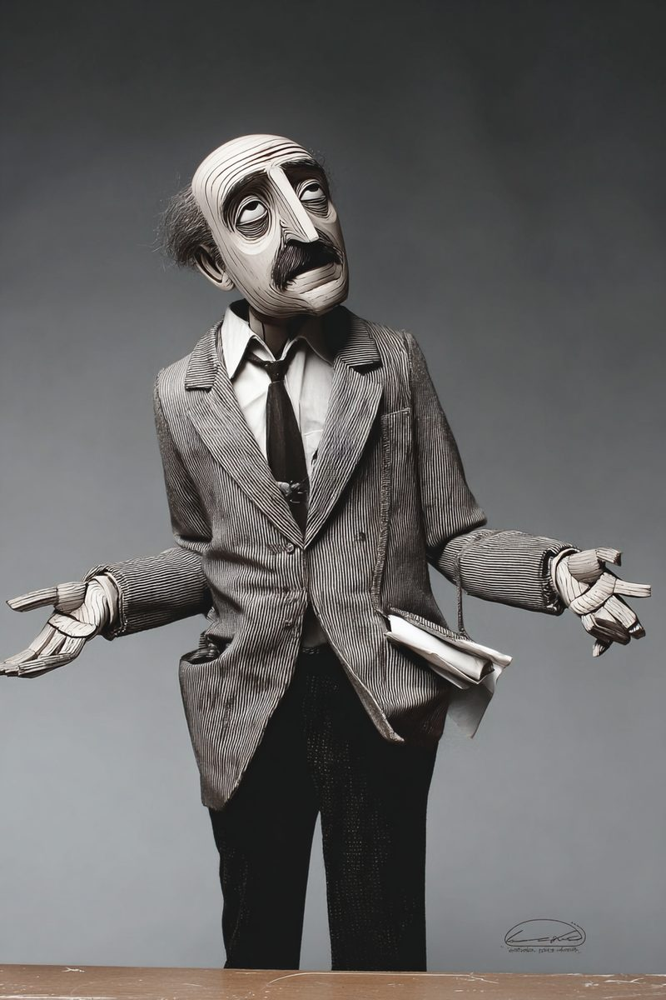

# Chapter 9 — Visual Identity Systems
*Design without strategy is the Pepsi document. Strategy without design is a Word doc with good intentions. The system is what happens when both are present.*

> **TL;DR:** This chapter turns brand strategy into a concrete visual system — color, type, and layout — that a stranger can read as "this brand." It explains why visual choices must follow from the archetype rather than personal taste, how to write a creative brief, and how to build an accessible palette and type system.
>
> | Section | Preview |
> |---|---|
> | What "Visual Identity" Actually Means | The six components that together signal which brand a viewer is looking at. |
> | Why Visual Decisions Need Archetypal Foundation | Why color and type choices should follow from the brand's archetype, not preference. |
> | The Creative Brief — Translating Strategy into Design | How to write the brief that turns strategy into clear design direction. |
> | Color Palette — Construction and Accessibility | Building a palette that expresses the brand and meets contrast and accessibility standards. |
> | Typography — Pair Logic and Specification | Choosing and specifying a typeface pairing that fits the archetype. |
> | Wireframes — Encoding the Archetype Structurally | How layout structure itself communicates the brand, before any styling. |
> | What the Visual Identity System Is Doing | Why a system of rules beats one-off design decisions. |

---

In 2008, Pepsi paid the design firm Arnell Group to redesign its logo. The result was a modest visual change — a slight tilt of the red-and-blue swoosh, a slightly different proportioning of the circle. What leaked was the 27-page internal rationale document. It invoked the Golden Ratio, the Mona Lisa, the Parthenon, Renaissance painting, the Vitruvian Man, the Theory of Relativity, and the gravitational pull of the Earth. Page after page of borrowed authority, assembled to explain a logo that moved a stripe by a few degrees.

The document became famous as a document about having nothing to say.

Here is what happened. Pepsi's brand had not committed to anything specific enough for the visual to express. The archetype was vague — broadly Innocent, with some Jester energy, but nothing that made any single design decision clearly right or clearly wrong. So when the designers had to justify their choices, they reached for external authority. The Mona Lisa did not authorize the logo. The logo authorized nothing. The resulting document demonstrated, publicly, that the brand did not know what it was.

Two other cases make the same point from different angles.

In 2013, Yahoo announced a "30-day logo journey" — publishing a different logo concept every day for a month before revealing the final mark. By day 30, Yahoo had demonstrated that no archetype was constraining the final choice, because the 30 daily concepts were not consistent with each other. The final logo read as committee output, because it was. Yahoo's visual identity never stabilized because the strategic substance required to anchor it was absent. The company was sold to Verizon in 2017 for less than $5 billion; at its peak it had been valued at over $100 billion.

In 2009, Tropicana's repackaging was technically accomplished design — clean typography, premium photography, simplified layout. It failed because it expressed the wrong archetype. The original orange-with-straw was Innocent: pure, simple, natural, unpretentious. The new packaging expressed Lover/Ruler positioning — elevated, aspirational, refined. The visual was good. It was an excellent expression of an archetype that was not Tropicana's. Sales dropped 20% in two months. The original packaging was restored.

Three failure modes. Strategy-free rationale (Pepsi). Strategy-free process (Yahoo). Wrong archetypal foundation (Tropicana). Every one of them was avoidable if the design had been required to answer to a prior strategic commitment.

Your visual work in this chapter has something to express: the archetype from Chapter 3, the strategy from Chapter 6, the tool you built. The system you build will cohere because it answers to those commitments. Coherence is the standard. Craft follows with time.

<!-- → [TABLE: Three failure cases — columns: brand, what was changed, the strategic failure, the archetypal mismatch, the brand consequence, the recovery action] -->


---

"Visual identity" covers six components that together tell a viewer what brand they are looking at. Most non-designers treat these as independent decisions. They are not. They are a system — each component is perceived in context with the others, and the context is the archetype.

**Logo and wordmark.** The single most-replicated mark, appearing at every scale from favicon to billboard. Three structural forms: a wordmark (the brand name, styled typographically), a symbol (a standalone graphic mark), and a lockup (symbol plus wordmark combined). For a new AI tool brand, a wordmark or wordmark-with-simple-symbol is the right starting point. Complex symbols require brand recognition that takes years to build.

**Color palette.** Primary, secondary, and neutral colors — four to six committed hex values plus their accessibility-tested variants. The palette is the highest-frequency brand signal: it appears in every pixel of every interface, every page of every document. Get it wrong and the archetype mismatch is felt on every visit.

**Typography.** A type system — typically one display face for headlines, one body face for running text — with weights and sizes specified for every context. Typography sets the brand's register before a word is read. A serif body face signals patience and depth. A compressed geometric sans-serif signals speed and efficiency. The choice is a brand commitment.

**Imagery direction.** What kinds of photographs, illustrations, icons, and visual metaphors fit the brand. This is a style commitment, not a specific asset: "authentic, slightly rough-edged photography, no stock images" versus "flat, geometric illustration, single accent color, minimal detail."

**Layout system.** Grid, spacing, and hierarchy rules that govern how all the above components arrange on a page or screen. The layout system is what makes a brand recognizable even when no logo is visible. The New York Times' two-column body with the display quote in the third column is an identity element as recognizable as the Gothic masthead.

**Motion** (where relevant for digital products). How elements appear, transition, and behave. A Sage brand's motion is deliberate, unhurried. A Hero brand's motion is dynamic, directional. For a portfolio and deployed AI tool, motion is a secondary concern — get the first five components coherent first.

<!-- → [TABLE: Six identity components — columns: component name, what it contains, how it expresses the archetype, most common failure mode when strategy is absent] -->


The system relationship is what matters. A logo that looks fine in isolation can clash with the wrong typography. A palette beautiful in print can fail accessibility on screen. A layout that works for long-form reading can feel slow for a task-oriented tool. The visual identity is the rulebook that prevents each component from making choices the others cannot support.

---

Before building the system, I want to make the mechanism explicit — why visual elements without archetypal foundation produce the Pepsi outcome.

Visual elements are perceived in context with each other. A user encountering a brand does not evaluate the logo, then separately evaluate the typeface, then separately evaluate the color. They perceive all of it simultaneously and form a single impression. That impression either coheres — the components reinforce a single message — or it conflicts. The user cannot always articulate what is wrong when components conflict, but they feel the wrongness as a vague sense that the brand is trying to be two things at once.

Archetypes are the mechanism that makes coherence achievable. When every component answers to the same archetype, they converge toward the same impression automatically — not because each is designed to match the others, but because each is designed to match the same underlying orientation.

Consider four archetypes and what their visual logic looks like in practice.

A **Sage** archetype's visual language is restrained, evidence-rich, often serif-anchored, with generous whitespace and high-contrast type. The New York Times. The Economist. Stripe's documentation site — the typography, color restraint, and systematic layout all signal: we have thought about this carefully. Sages do not decorate; they clarify.

A **Hero** archetype's visual language is bold, saturated, dynamic, often diagonal or motion-implying. Nike. Red Bull. Apple's iPhone launch campaigns. Strong contrast, athletic typography, layouts that imply momentum. Heroes do not explain; they demonstrate.

A **Caregiver** archetype's visual language is warm, approachable, soft-edged, with palettes that run toward earth tones or pastels. Johnson & Johnson. Headspace. Caregivers do not challenge; they embrace.

A **Magician** archetype's visual language uses jewel tones, intentional gradients, unexpected combinations that imply transformation. Early Adobe. Spotify's canvas features. The archetype implies that something ordinary will become extraordinary — the visual should feel like it is already in transition.

These are not arbitrary conventions. Each is a documented response pattern to how users form impressions of brands. When the visual matches the archetype, the brand communicates immediately, without a 27-page explanation. When it mismatches, the "BreathTaking" document happens.

<!-- → [DIAGRAM: Four-quadrant archetype visual logic grid — axes: warm/cool (horizontal) and restrained/expressive (vertical); Sage in restrained/cool quadrant, Caregiver in restrained/warm, Hero in expressive/cool, Magician in expressive/warm; each quadrant annotated with palette direction, type direction, and one brand example] -->


---

The creative brief is the artifact that translates brand strategy into design constraints. It is the most important document in the visual identity process because it is the only moment where strategic commitments are made explicit as design requirements before any visual work begins. Once the brief is written, every subsequent visual decision can be evaluated against it. Without the brief, decisions are made by taste — made inconsistently — and the system does not cohere.

A complete brief has eight sections, each functioning as a constraint rather than a description.

**Brand strategy summary.** Four to six sentences pulled from Chapter 6 — mission, archetype, audience, voice. This section exists to make clear that the design must express the strategy, not invent a new one.

**Project scope.** What, specifically, is being designed. For this chapter: logo direction, color palette, typography pair, mood board, website wireframe, one-page brand guidelines. Scope prevents the brief from expanding to include every possible surface.

**Audience.** Named and specific. Not "marketing professionals" — "marketing managers at small B2B SaaS companies with no dedicated analytics team who will use the tool on Monday mornings." The audience description determines what visual language will read as trustworthy to the specific people the tool is for.

**Tone words.** Three to five adjectives describing how the design should *feel*. The discipline here is that vague words are forbidden. *Innovative*, *modern*, *clean*, *professional* are anti-words — they describe nothing, constrain nothing, and could apply to any brand. Tone words that do work: *Restrained, evidence-forward, patient* for a Sage. *Decisive, saturated, kinetic* for a Hero. *Warm, unhurried, grounded* for a Caregiver. *Luminous, transitional, unexpected* for a Magician. Each one narrows the design space in a direction the archetype implies.

**References.** Three to five examples of visual work capturing the desired direction, each with a note on what specifically works for this brief. "Stripe's documentation site — the way it uses whitespace to make dense technical content feel readable without dumbing it down" is a reference. "I like Stripe" is not.

**Anti-references.** Two to four examples of what to avoid, each with a note on why it fails the brief. Anti-references are often more useful than references because they make the negative space explicit. A Sage brand's anti-reference might be: "Red Bull's visual identity — saturated, diagonal, high-motion energy is exactly the archetypal mismatch we need to avoid. Our users want to trust the analysis; Hero-archetype visual language implies salesmanship, not rigor."

**Constraints.** Platform requirements, accessibility requirements, anything inherited from existing brand elements that cannot change.

**Deliverables.** A numbered list of what the brief expects to be produced. Clear deliverables prevent scope creep and give a concrete checklist for self-evaluation.

The brief should be dense — one to two pages, no padding. Every sentence is a constraint. A sentence that cannot be used to evaluate a design decision should be cut.

<!-- → [TABLE: Creative brief section anatomy — columns: section name, the question it answers, what a weak entry looks like, what a strong entry looks like] -->


---

Color is the highest-frequency brand signal. Every pixel of every interface carries the palette. A wrong color decision is encountered more often than any other wrong decision in the system.

Palette construction starts from the archetype, not from personal preference.

A **Sage** palette is restrained, high-contrast, low-saturation. A Sage brand does not decorate with color; it uses color to organize information. The primary is often a near-neutral — dark slate, deep teal, ink blue. The accent is used sparingly and purposefully. The neutral system does the heavy lifting: a near-black for body type, a near-white for backgrounds, one or two mid-grays for secondary information.

A **Hero** palette uses saturated primaries, strong contrast, motion-implying hues. The primary is often a saturated red, electric blue, or deep orange. The accent amplifies the primary rather than complementing it. The neutral system is minimal — the brand lives in the saturated zone.

A **Caregiver** palette is warm, approachable, soft. Earth tones, muted greens, warm grays. Nothing that reads as aggressive, cold, or clinical. The primary often sits in a warm mid-range — terracotta, sage green, warm stone.

A **Magician** palette uses jewel tones, intentional gradients, chromatic depth. Deep purples, emerald greens, midnight blues. The palette implies richness and the possibility of change.

A minimum viable palette has five components: one primary, two accents, and two neutrals (near-black and near-white). A full palette adds one or two mid-neutrals for secondary information. For each color, commit a name and a hex value. The name is for human communication; the hex is for implementation. Document both.

<!-- → [TABLE: Palette construction guide by archetype — columns: archetype, primary color direction, accent direction, neutral system character, palette to avoid (anti-archetype), real-world brand example] -->


### Accessibility Testing

Every text-on-background combination used in the interface must pass WCAG 2.2 AA standards at minimum. The numbers are specific and non-negotiable: normal text (below 18pt) requires a contrast ratio of 4.5:1; large text (18pt and above) and graphical objects require 3:1. Test every combination you intend to use. The WebAIM Contrast Checker takes two hex values and returns the ratio.

Document the results in a table: color name, hex, background hex, contrast ratio, pass/fail. Every fail requires a hex adjustment — usually darkening the text color or lightening the background. Small shifts in value can bring a failing combination into compliance without changing the palette's visual character.

Here is what a partial accessibility audit looks like for a Sage-archetype palette:

| Combination | Foreground | Background | Ratio | AA Normal | AA Large |
|---|---|---|---|---|---|
| Body text on white | #1A1A2E | #FAFAF8 | 17.4:1 | ✓ | ✓ |
| Secondary text on white | #6B7280 | #FAFAF8 | 4.6:1 | ✓ | ✓ |
| Accent on white | #0D5C63 | #FAFAF8 | 8.9:1 | ✓ | ✓ |
| White text on accent | #FAFAF8 | #0D5C63 | 8.9:1 | ✓ | ✓ |
| Caption text on white | #9CA3AF | #FAFAF8 | 2.9:1 | ✗ | ✓ |

Caption text failed at normal-text size. The fix: darken it to #6B7280, which returns 4.6:1 — a pass. The palette character does not change; the implementation is now compliant.


The accessibility audit is not optional. WCAG 2.2 AA is a legal requirement in many jurisdictions for public-facing digital products, not a best-practice recommendation. Document every failure and its resolution before launch.

---

Typography does two jobs simultaneously. It does the legibility job — making text readable at the sizes and contexts where it appears. And it does the archetype job — signaling the brand's personality before the reader has processed a single word.

Most visual identity systems use two typefaces: a display face for headlines, and a body face for running text and UI. The display face carries more archetypal weight; the body face carries more legibility weight. When both are doing both jobs well, the system is strong.

**Sage archetypes** lean toward classical or contemporary serifs for display — faces with historical authority and legibility at reading sizes: Tiempos Text, GT Sectra, Source Serif 4, Playfair Display. The body face is typically a humanist sans-serif that reads cleanly in UI contexts: Inter, IBM Plex Sans, Source Sans 3. The combination signals: we have thought carefully and written clearly.

**Hero archetypes** lean toward bold geometric or grotesque sans-serifs for display — faces that imply confidence and momentum: Aktiv Grotesk, Founders Grotesk, DM Sans at heavy weights. The body face is usually from the same family at regular weight. The combination signals: we are fast and we are right.

**Caregiver archetypes** lean toward rounded sans-serifs or warm humanist typefaces: Nunito, Mulish, Lato, Figtree. The body face matches the warmth of the display face. The combination signals: we are approachable and we are here for you.

**Magician archetypes** have the most flexibility — they can use display faces with dramatic proportions or unusual character details: Fraunces (variable, with optical sizes that shift at display scale), Playfair Display at heavy weights. The body face grounds the display face's drama in readability. The combination signals: transformation happens here.

For a course project deployed on a public portfolio, use typefaces with open licenses — Google Fonts covers all four archetypes: Source Serif 4 + Inter for Sage; DM Sans as a single-family system for Hero; Nunito + Lato for Caregiver; Playfair Display + Source Sans 3 for Magician.

Choosing the typefaces is not enough. You need to specify how they are used:

- **Display / H1:** Source Serif 4, 700, 56px / 1.1 line height, −0.02em tracking.
- **H2:** Source Serif 4, 600, 36px / 1.2.
- **H3:** Inter, 600, 24px / 1.3.
- **Body:** Inter, 400, 16px / 1.6.
- **Caption / label:** Inter, 400, 13px / 1.4.
- **UI elements:** Inter, 500, 14px / 1, 0.02em tracking.

The specification prevents drift. Without it, every new page is a new typographic decision — and the accumulated inconsistency destroys system coherence over time.

<!-- → [TABLE: Archetype typography pair guide — columns: archetype, recommended display face, recommended body face, what the pairing signals, type to avoid, example brand using this pairing logic] -->


---

The wireframe is a low-fidelity structural plan for the portfolio site. Its job is to specify page hierarchy, section order, layout grid, and component reuse — before any visual rendering happens.

A wireframe looks like boxes and labels. It does not look like a finished design. This is intentional. The wireframe encodes structural decisions that, once made in code, are expensive to change. Making them at the wireframe stage — where a change is a box moved on a page — is the right time.

Five pages for a portfolio: Home, About, Projects, Writing, Contact. Every page beyond five needs explicit justification. The portfolio visitor's time is finite and each additional page dilutes the focus.

The section order on each page is not neutral — it is an archetype expression. The home page for a Sage might run: above-the-fold hero with name and positioning sentence; selected work section with three project cards; a writing section with one featured piece; a brief bio linking to About; footer with contact and links. That order encodes a priority: *who I am and what I do* → *evidence* → *thinking* → *connection*. A Hero archetype might reorder: lead with the most impressive project, follow with a performance metrics strip, then bio, then writing.

The layout grid is the architectural decision that makes the layout feel intentional rather than arbitrary. For a text-forward Sage: 12-column grid, max width 1100px, 60-character line length for body text. For a visual-forward Hero: wider column spread, 1440px max width, more image real estate.

Define components once and reuse them. A project card appears on the home page and the Projects page. A writing card appears on the home page and the Writing index. The footer is identical across all pages. Defining components at the wireframe stage means the Chapter 11 build prompt can reference them by name.

The wireframe encodes the archetype in its structural rhythm even at low fidelity. A Sage wireframe has more text density, longer-form sections, fewer full-bleed images, and a home page that leads with the positioning sentence — the Sage leads with the thinking, not the image. A Hero wireframe has a large above-the-fold image, a metrics strip, short punchy section copy, and a primary CTA that implies action. A Caregiver wireframe uses softer section transitions, more white space between elements, and a contact page that emphasizes ease of reach. A Magician wireframe experiments with layout conventions — sections not full-width, typographic elements that break the grid intentionally, a home page that opens with an unexpected visual rather than the conventional name-and-title hero.


*Figure 9.1 — Sage vs. Hero home-page wireframes*

---

The visual identity system closes a design loop that opened in Chapter 6.

Chapter 6 produced a brand strategy — the theory of who you are and what you are for. The creative brief translated that strategy into design constraints. The palette expressed the archetype in color. The typography expressed the archetype in type. The wireframe expressed the archetype in structure. The brand guidelines document captures all of those decisions in a single reference any future collaborator can use.

The system relationship is what makes the whole more than the sum of the parts. A palette without a type system is a color mood board. A type system without a layout system is a font choice. A layout system without an archetype is a default template. The system is what happens when all components answer to the same strategic archetype.

Test the system by giving the brand guidelines document to one classmate who has not been involved in your brand work. Ask them to make one design decision using only the document — pick a color for a button state, choose a headline weight for a new page — and then evaluate whether their choice was archetype-aligned. If it was, the document is specific enough. If it was not, find the gap: was the tone words section too vague? Was the palette missing a variant? Was the typography specification missing a weight?

The brand guidelines document is a living artifact. Chapter 11 will use it to build the portfolio; Chapter 12 will use it to produce the pitch deck. Every use is a test. Fix what fails.

---

I should be honest about what this chapter's argument cannot do.

The causal evidence for visual identity's impact on user trust in AI tools specifically is thin. The mechanism I describe — that coherent visual identity accelerates trust formation and reduces cognitive friction — is plausible and supported by branding research, but the evidence specific to AI tools is largely anecdotal. If controlled studies showed that archetype-aligned AI tools do not outperform tools with arbitrary visual identities in user trust or retention when controlling for product quality, this chapter's emphasis would be misplaced.

The second limit: the boundary between visual identity work that *expresses* an archetype and visual identity work that *creates* one. Some brands arrived at their archetype through the visual — the visual was so distinctive that the brand had to build itself around what the visual communicated. Apple's "Think Different" campaign may be a case: the campaign preceded the strategic clarity, and the strategy emerged from the campaign's reception. This chapter teaches strategy-first as the default. The visual-first path exists, and I do not yet have a clean rule for when it is the right choice.

---

## What Would Change My Mind

A controlled study showing that archetype-aligned visual identity does not causally affect user trust or retention for an AI tool, when controlling for product quality. The evidence I have is anecdotal and survivor-biased. The three failure cases — Pepsi, Yahoo, Tropicana — are cases where the mismatch was severe enough to produce measurable damage. Smaller mismatches may be tolerated, may be invisible, or may not matter at all for AI tools specifically.

## Still Puzzling

When does the visual-first path work? Apple's "Think Different" is the candidate case, but it is also the most over-determined case in technology branding — exceptional creative team, exceptional media moment, exceptional products arriving right after. Separating the visual-first path from the other over-determining factors is genuinely hard. I suspect the visual-first path works only when the visual is so distinctive it creates its own interpretive frame, and fails whenever the visual is merely unusual rather than genuinely generative. But I do not have a clean account of the distinction.

---

## Exercises

### Warm-Up

**W1.** For each of the following brand visual elements, identify which archetype it expresses and name one specific aspect of the element that signals that archetype: (a) The New York Times masthead — large Gothic serif, all-caps, high contrast, no decoration. (b) Red Bull's can design — saturated red and silver, diagonal energy-trail motif, bold geometric sans-serif. (c) Headspace's app icon — orange circle, soft corners, minimal detail. (d) Notion's brand identity — near-black and near-white, minimal color, humanist sans-serif, generous whitespace.
*Tests: archetype reading from visual elements.*
*Difficulty: Low.*

**W2.** The chapter identifies three anti-words that do not constrain design decisions: *innovative*, *modern*, *clean*. For each anti-word, write a replacement that is specific enough to constrain a design decision, is aligned to one archetype, and could not be applied to every brand equally. Justify each replacement in one sentence.
*Tests: tone word discipline — the difference between decorative and constraining description.*
*Difficulty: Low.*

**W3.** Run an accessibility audit on the following palette combinations using WCAG AA standards (4.5:1 for normal text, 3:1 for large text). For each combination that fails, propose a hex adjustment that passes while maintaining the palette's character. Use WebAIM Contrast Checker or equivalent: (a) body text #333333 on background #FFFFFF; (b) secondary text #888888 on background #FFFFFF; (c) accent text #4A90E2 on background #FFFFFF; (d) white text #FFFFFF on button color #6C63FF; (e) caption text #AAAAAA on background #F5F5F5.
*Tests: accessibility audit mechanics and fix logic.*
*Difficulty: Low-medium.*

### Application

**A1.** Write a complete creative brief for your AI tool's visual identity. Include all eight sections: brand strategy summary, project scope, audience, tone words (three to five, no anti-words), references (three, with specific notes), anti-references (two, with notes), constraints, and deliverables. Length: one to two pages. Test the brief by evaluating one design direction against it — pick any visual approach and argue whether it passes or fails.
*Tests: brief construction and brief-as-evaluation-instrument.*
*Difficulty: Medium.*

**A2.** Build a color palette for your AI tool's brand using your archetype as the starting point. Specify one primary, two accents, and three neutrals — name and hex for each. Run the full accessibility audit: test every combination you intend to use for text-on-background against WCAG AA. Document results in a table. Fix every failing combination.
*Tests: palette construction from archetype and accessibility compliance.*
*Difficulty: Medium.*

**A3.** Select a typography pair for your AI tool's brand. Justify each choice in one paragraph that explicitly references your archetype and names what the typeface signals. Produce the full type specification — H1 through H3, body, caption, UI — with size, weight, and line height for each.
*Tests: typography selection and specification.*
*Difficulty: Medium.*

**A4.** Find a real deployed AI product whose visual identity has an archetypal mismatch — where the visual language contradicts what the product actually is or does. Describe: the product and its actual purpose, the archetype the visual identity expresses, the archetype the product strategy actually implies, the specific components in conflict, and what a single highest-leverage change would be to reduce the mismatch.
*Tests: archetypal mismatch diagnosis on a novel case.*
*Difficulty: Medium.*

### Synthesis

**S1.** The chapter traces three visual-identity-without-strategy failures: Pepsi 2008 (strategy-free rationale), Yahoo 2013 (strategy-free process), Tropicana 2009 (wrong archetypal foundation). Each had a different cause and required a different fix. Design a pre-launch visual identity review process that would catch all three failure modes before launch. Apply your process to one of the three cases and show whether it would have flagged the problem.
*Tests: systematic reasoning about failure modes and their prevention.*
*Difficulty: Medium-high.*

**S2.** Produce two wireframe descriptions in structured text for the same five-page portfolio: one for a Sage archetype, one for a Hero archetype. The pages are the same (Home, About, Projects, Writing, Contact); the section order, density, and component character should differ. Annotate the structural differences that are archetypal expressions rather than personal preferences.
*Tests: encoding archetype in layout structure, not just styling.*
*Difficulty: High.*

**S3.** The "Still Puzzling" section identifies the visual-first path — where the visual identity creates the archetype rather than expressing it. Find one brand (not Apple's Think Different) where the visual identity preceded and shaped the strategic archetype. Describe: the visual that came first, the strategic clarity that followed, how the brand's later behavior validated or invalidated the emergent archetype, and what conditions enabled the visual-first path to work. Conclude with a proposed rule for when visual-first is the right choice — and when it is a mistake.
*Tests: stress-testing the strategy-first default with a real countercase.*
*Difficulty: High.*

### Challenge

**C1.** The WCAG 2.2 AA standards in this chapter are legal requirements in many jurisdictions for public-facing digital products, not just best practices. Research: which jurisdictions have legal accessibility requirements for web content, what standard they reference, and what the enforcement mechanism is. Then evaluate your own tool's deployed interface against the AA standard. Document every failure, name the specific WCAG criterion violated, propose a fix, and estimate the implementation time. Conclude with a prioritized remediation list.
*Tests: accessibility as legal obligation and hands-on audit of a real product.*
*Difficulty: Very high.*

**C2.** The "What Would Change My Mind" section concedes that causal evidence for visual identity's impact on user trust in AI tools is thin. Design a study that could establish whether archetype-aligned visual identity causally affects user trust and retention for an AI tool, as distinct from product quality. Specify: the independent variable, the dependent variable, the control for product quality, the population, the study duration, and the minimum effect size you would need. Evaluate the study's practical feasibility and ethical considerations.
*Tests: study design and engagement with the chapter's own evidentiary limits.*
*Difficulty: Very high.*

---

## LLM Exercise — Self-as-Project

**Project:** Self-as-Project
**What you're building this chapter:** A **Personal Visual System v1** — palette, typography, mood board instructions, and wireframe for your personal portfolio site.
**Tool:** Claude Project for the system specification; Figma, Excalidraw, Whimsical, or pen-and-paper for the wireframe.

**The Prompt:**

```
Build a Personal Visual System for me, derived from my Personal Brand
Strategy v1 (from Chapter 6). The deliverables here feed the portfolio
site I build in Chapter 11.

Five components, each constrained by my archetype:

1. CREATIVE BRIEF (1 page). Strategy-to-design translation. Sections:
   - Brand strategy summary (3–4 sentences from Chapter 6)
   - Project scope (personal site + LinkedIn banner + resume header)
   - Audience (named and specific)
   - Tone words (3–5 archetype-aligned adjectives — "innovative" and
     "modern" forbidden; force specificity)
   - 3 references (link or describe — with one-line notes on what
     specifically about each one works for this brief)
   - 3 anti-references (with one-line notes on why each fails the brief)

2. COLOR PALETTE. Primary (1), accents (2), neutrals (near-black,
   near-white, mid-gray). Specify: name + hex for each. Test every
   text-on-background combination against WCAG AA (4.5:1 normal text,
   3:1 large text). Document contrast ratios in a table. If a combination
   fails, propose an adjusted hex that passes.

3. TYPOGRAPHY PAIR. One display face for headlines, one body face for
   running text. Both must have a free/open-source option (Google Fonts
   acceptable). Justify each choice against my archetype in one sentence.
   Specify: weights (minimum heavy display, regular body, one alternate
   for emphasis); sizes for h1, h2, h3, body, caption, UI.

4. MOOD BOARD INSTRUCTIONS. Tell me to pull 6–10 images. List specifically
   what to look for (e.g., "find 2 examples of personal sites by
   Sage-archetype practitioners using serif body type and a single
   accent color"). Caption requirements for each image: what about
   it works for my brief.

5. WIREFRAME for my personal site. Low fidelity. Five pages: Home, About,
   Projects/Case Studies, Writing/Thought Leadership, Contact. For each
   page: section blocks in order, layout grid (column count, max content
   width), visual hierarchy (where H1, primary CTA), components reused
   across pages. Format as structured Markdown detailed enough to use
   as a v0 prompt directly.

Apply my archetype as the constraint throughout. A Sage palette is
restrained and high-contrast. A Hero palette uses saturated primaries.
A Caregiver palette runs warm. A Magician palette uses jewel tones.
Match my archetype exactly — don't average across archetypes.

Output a Markdown document called "Personal Visual System v1 — [my name]"
with all five components.
```

**What this produces:** A complete visual identity spec ready for Chapter 11's portfolio build. The palette hex codes and typography specification become the v0 prompt's design tokens. The wireframe section blocks become the page structure.

**How to adapt:** If you already have visual brand elements — a chosen typeface, a color you have used consistently — provide them as inputs and ask for an audit and alignment fix rather than a from-scratch design. The audit question: does this visual element express my archetype, or is it here because of preference?

---

## AI Wayback Machine

The ideas in this chapter didn't appear from nowhere. **Saul Bass** was a graphic designer who, across the second half of the twentieth century, designed some of the most enduring corporate identities ever made — the AT&T globe, the Bell System bell, the United Airlines "tulip," logos for Continental and United Way — and reinvented the film title sequence with kinetic, abstract openings for *Vertigo*, *Psycho*, and *Anatomy of a Murder*. His working principle was reduction toward a single durable mark: strip a brand down to the simplest form that still carries its meaning, then let that form work at every scale and survive for decades. That is this chapter's argument about the logo and wordmark — start simple, because a complex symbol demands recognition you have not earned yet — and his title-sequence work is the chapter's point about *motion* as a brand component: how a mark appears and moves communicates as much as the mark itself. Bass also embodies the chapter's central discipline, that visual decisions must answer to the brand's strategy rather than personal flourish; he famously insisted a logo had to symbolize what the company *was*, not merely decorate it.



*Saul Bass — the designer who reduced a brand to the simplest durable mark and made it move.*

**Run this:**

```
Who was Saul Bass, and how does his approach to corporate logos (the AT&T globe,
the Bell System mark) and film title sequences connect to this chapter's argument
that a visual identity is a system of disciplined choices — start with a simple
mark, let it work at every scale, and make motion express the same archetype?
Keep it to three paragraphs. End with the single most surprising thing about his
career or ideas.
```

→ Search **"Saul Bass"** on Wikipedia after you run this. See what the model got right, got wrong, or left out.

**Now make the prompt better.** Try one of these:

- Ask it to explain, in plain language, why a *simple* mark survives longer than a complex one — and why a new brand should start simple
- Ask it to connect Bass's title-sequence work to this chapter's treatment of *motion* as a visual identity component for digital products
- Add a constraint: "Answer as if you're deciding between a wordmark and a complex symbol for a brand-new AI tool, governed by the archetype from Chapter 6"

What changes? What gets better? What gets worse?

---

## AI+1 — Self-as-Project on Madison

**Project:** Self-as-Project — *your brand, end to end*
**This chapter adds:** a visual identity system plus a coherence-and-accessibility QA pass.
**Madison recipes:** [`madison-brand-consistency-contradiction-checker`](../madison/recipes/madison-brand-consistency-contradiction-checker.md), [`madison-qa-accessibility-audit`](../madison/recipes/madison-qa-accessibility-audit.md)

> Design without strategy is the Pepsi document; the system requires both (this chapter's thesis). You make the design calls; Madison audits for contradiction and accessibility; you decide what to fix.

### Exercise 1 — When to Use AI
- *Tabulate your visual system's six components into a spec sheet.* **Why it works:** reformatting.
- *Run a contradiction check across your assets for off-system uses.* **Why it works:** pattern-spotting at scale.
- *Run an accessibility audit (contrast, alt text, type sizes).* **Why it works:** rule-checking the model does reliably.

**Tell:** you can verify each flagged contradiction against the spec yourself.

### Exercise 2 — When NOT to Use AI
- *Choosing the type pairing and palette.* **Why it fails:** taste, tied to archetype.
- *Deciding which "contradiction" is intentional flexibility vs. drift.* **Why it fails:** a system-design judgment.
- *Approving the final system.* **Why it fails:** brand coherence is owned, not generated.

**Tell:** you've crossed the line when the checker's flag overrides a deliberate design choice without your review.
**Series connection:** trains coherence — strategy and design together.

### Exercise 3 — Recipe Exercise
**Build:** a visual-system spec + a QA report. **Run:** [`madison-brand-consistency-contradiction-checker`](../madison/recipes/madison-brand-consistency-contradiction-checker.md) then [`madison-qa-accessibility-audit`](../madison/recipes/madison-qa-accessibility-audit.md) over your assets. **Tool:** Claude / Claude Code.

```
Using the Madison brand-consistency-contradiction-checker + qa-accessibility-audit
recipe approach, review my visual system (six components below) plus 3–5 sample
assets. Output: (1) contradictions vs. the spec, each tagged INTENTIONAL or DRIFT
[my call to confirm]; (2) an accessibility table (contrast ratio, alt text present,
min type size) with pass/fail. Flag, don't fix. Cite the asset for each flag.

System + assets:
[PASTE]
```
**Adapt:** the contrast check pairs with the repo's `scripts/svg-layout-audit.mjs` for figures.

### Exercise 4 — CLI Exercise
**Build:** `your-brand/visual-system.md` + `your-brand/qa-report.md`. **Tool:** [`wrap-your-tool`](../madison/wrap-your-tool/) or Claude Code.

```
Write your-brand/visual-system.md (the six components) and your-brand/qa-report.md
(contradiction table: asset | issue | intentional/drift | evidence; accessibility
table: asset | contrast | alt | type size | pass/fail). Flag only; make no edits to
assets. Stop after writing the files.
```
**Inspect:** every flag cites a real asset; accessibility failures have measured ratios, not guesses.
**If it goes wrong:** the checker calls deliberate variation "drift" — re-tag intentional uses yourself.

### Exercise 5 — AI Validation Exercise
**Validate:** the QA report. Pass / Fail / Cannot-determine + evidence:
- **Correctness:** are contrast ratios measured, not estimated?
- **Completeness:** all six components specified; all sample assets audited?
- **Scope:** flags only — no unrequested redesign?
- **Brand-specific:** does the system express the committed archetype?
- **Failure-mode:** any "drift" flag that is actually intentional system flexibility? Re-tag it.

*Tags: visual-identity · creative-brief · pepsi-logo · yahoo-logos · tropicana-redesign · WCAG-accessibility · color-palette · typography · wireframe · archetype-expression · INFO-7375*
