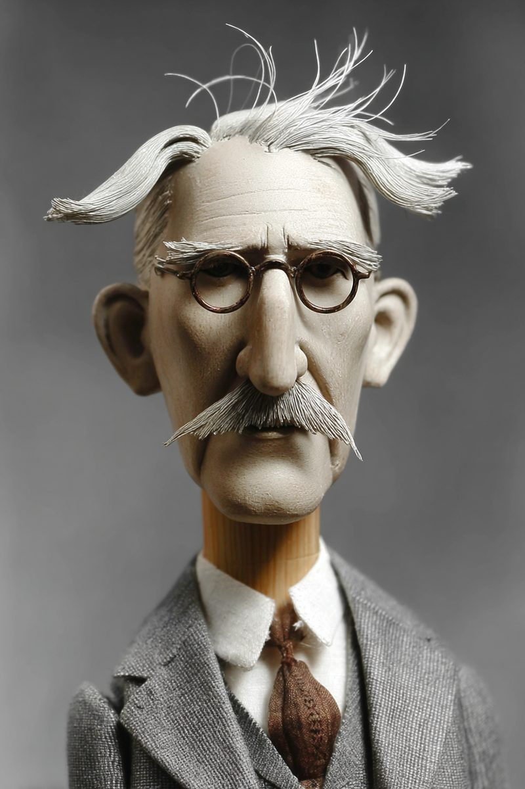

# Chapter 11 — Brand Experience & Touchpoints
*For most customers, the experience is the brand. They never read your strategy deck.*

> **TL;DR:** A brand is experienced across many touchpoints, not in a single ad or screen — and the experience *is* the brand for nearly everyone. This chapter teaches the experience economy, journey mapping, and moments of truth, and has you map your brand's customer journey and build one AI-assisted touchpoint that holds the archetype under pressure.
>
> | Section | Preview |
> |---|---|
> | The Experience Is the Brand | Why the strategy lives or dies at the points of contact, not on the slide. |
> | Goods, Services, Experiences | The value ladder that explains why experience became the differentiator. |
> | Mapping the Journey | A method for laying out every contact from first awareness to post-purchase. |
> | Moments of Truth | The few touchpoints that carry disproportionate brand weight. |
> | Consistency Across Channels | Holding the archetype and voice while adapting to each surface. |
> | Worked Example: Map and Build a Touchpoint | Mapping the journey and building an AI concierge that stays on-brand. |

---

There is a gap between what a company believes its brand is and what customers actually experience. The company knows its strategy. It wrote the positioning statement, chose the archetype, approved the visual identity system. Customers know none of that. What they know is the ad that appeared before a YouTube video they were trying to watch, the email that arrived at 6 AM about a password reset, the support chat that made them wait eleven minutes and then closed the ticket without resolving anything. From those contacts they infer who the brand is. The inference is usually accurate.

This is the thing that makes brand experience feel like a different discipline from brand strategy, even though it is the same discipline at a different level of resolution. Strategy decides what the brand should mean. Experience decides whether it actually means that. The gap between the two is where equity is won or lost — and it is almost always lost in the touchpoints nobody designed.

## The Experience Is the Brand

Here is a simple test. Take a company with a warm, human brand voice — empathetic tagline, rounded logo, friendly marketing copy that sounds like a person and not a corporate entity. Now route a customer through a support interaction: automated phone tree, hold music, transfer to a second agent who cannot see what the first one did, resolution that requires the customer to call back. Ask what that customer's model of the brand is after that experience. It is not the tagline.

A brilliant positioning statement that contradicts the support experience loses to the support experience. Every time. People believe what happens to them, not what you claim. The principle is uncomfortable because it means that brand work is not done when the strategy is written or when the visual identity is locked. It is done — or undone — in every subsequent contact, including the ones that feel like operational problems rather than brand problems.

The support ticket is a brand problem. The onboarding email is a brand problem. The cancellation flow is a brand problem. The error message that appears at 2 AM when someone is trying to submit something time-sensitive is a brand problem.

The discipline of experience design, applied to brand, is the attempt to make every meaningful contact express the same archetype, voice, and promise — and to find, specifically, the contacts that carry the most weight.

<!-- → [DIAGRAM: The gap between brand strategy (top) and brand experience (bottom) — strategy layer: positioning, archetype, visual identity; experience layer: ad, email, support chat, onboarding, cancellation flow; arrows showing where the gap opens and where equity leaks] -->


## Goods, Services, Experiences

To understand why brand experience has become the primary competitive battleground, it helps to understand the economic shift that made it so.

Joseph Pine and James Gilmore described this in *The Experience Economy* (1999): value in a market follows a progression from commodities to goods to services to experiences, and at each step the premium layer shifts. Commodities are undifferentiated by definition — a barrel of oil is a barrel of oil. Goods are differentiated by features. Services are differentiated by reliability and expertise. But as goods and services commoditize — as features converge and service levels become table stakes — the differentiated layer becomes the *experience* built around them.

Coffee is the clearest example. The coffee commodity is worth a few cents. Ground coffee in a can is worth a dollar or two. A sit-down coffee service is worth several dollars. A Starbucks experience — the particular atmosphere, the personal-name rituals, the seasonal menu, the sense of a "third place" between home and work — is worth considerably more. The commodity is identical at every level. What changes is the experience staged around it.

Pine and Gilmore's argument is that companies compete by *staging* experiences, the same way a theater stages a performance. The product is the prop; the experience is the show. For any brand that takes this seriously, it reframes what the company is actually building. The tool is not the product. The experience of using the tool — the first run, the onboarding email, the moment something breaks and the error message is the only thing between the user and frustration — is the product.

Artificial intelligence accelerates this dynamic. As AI makes it cheaper and faster to build functional software, functional parity arrives faster. The features commoditize. What remains as differentiator is the experience: the voice, the feel, the sense that this particular brand understands something about the user that its competitors do not.

<!-- → [DIAGRAM: Pine/Gilmore value ladder — commodity → good → service → experience — with premium and differentiation markers at each stage; annotation showing where AI compression accelerates the move toward experience as the remaining differentiator] -->


## Mapping the Journey

A customer journey map is a tool for making the whole contact surface visible at once. The premise is simple: a customer does not arrive at your brand fully formed. They move through stages — first becoming aware that something like your brand exists, then considering whether it fits what they need, then purchasing, then onboarding, then using over time, then either leaving or advocating to others. At each stage, specific touchpoints are doing the brand's work (or failing to).

The standard stages are awareness, consideration, purchase, onboarding, use, renewal, and advocacy — though the specific stages vary by product and need to be adapted rather than applied mechanically. What matters is completeness: every stage from "customer had no idea this existed" to "customer is telling someone else about it."

For each stage, the map asks: what is the touchpoint (the specific contact — the ad, the homepage, the first email, the help documentation)? What is the brand's job at this touchpoint (what should the customer feel, understand, or be able to do)? What is the customer's emotional state going in? Does the touchpoint deliver on the brand's job?

George Lynn Shostack's service blueprinting method adds a second layer the journey map often omits: the back-stage. For every front-stage touchpoint — every contact the customer actually has — there is a set of back-stage operations that must execute for the front-stage to work. The map shows where those operational dependencies exist, which matters because a brand promise made at the front stage is only as good as the operations behind it. A promise of fast resolution in the support chat is a front-stage brand claim. Whether there is actually a back-stage system that can resolve tickets fast is an operational fact. The gap between the two is where brand promises die.

<!-- → [TABLE: Customer journey map template — rows: stage (awareness through advocacy); columns: touchpoint, customer emotional state, brand's job, back-stage dependency, current performance vs. archetype — shows the full structure] -->


The map's value is not the map itself. It is the moment when you lay out every touchpoint and can see, for the first time, where the brand is strong, where it is absent, and where two adjacent touchpoints are communicating contradictory things. A warm, human-voiced marketing email followed by a cold, formal support confirmation is a seam. Customers feel seams before they can name them.

## Moments of Truth

Not every touchpoint carries equal weight. Some contacts are so influential — either because they occur at a high-stakes decision point or because they are so formative that they set the customer's model of the brand for everything that follows — that they deserve disproportionate design attention.

Procter & Gamble coined the vocabulary here. The **First Moment of Truth** (FMOT) is the shelf moment: the three to seven seconds when a customer stands in front of a product and decides whether to pick it up. The **Second Moment of Truth** (SMOT) is the use moment: whether the product delivers on what the packaging promised. Google added a third, earlier term: the **Zero Moment of Truth (ZMOT)** — the pre-purchase research that happens online before the customer reaches the shelf or the checkout. `[verify: confirm ZMOT framing remains the current standard in marketing literature — terminology evolves.]` The research moment shapes what the customer is looking for and whether the brand's shelf presence or homepage communicates what they already expect.

For software and service brands, the equivalent moments are different but the logic is the same. The first run of the product — the moment a new user understands whether it does what they hoped — is a moment of truth. The first support interaction is a moment of truth. The renewal decision is a moment of truth. These are the touchpoints where the customer's model of the brand is most malleable, most rapidly updated, and most consequential.

The map reveals where these moments are. The design work is to find them and over-invest there. Under-investing at a moment of truth while over-investing at a low-stakes touchpoint is a common allocation error. Most companies spend more on the acquisition ad (which a customer sees once) than on the onboarding experience (which sets the customer's model of the brand for everything that follows).

<!-- → [DIAGRAM: Customer journey arc with moments of truth marked as peaks — ZMOT before first contact, FMOT at first decision point, SMOT at first use, plus brand-specific moments (first support interaction, renewal) annotated with relative design investment recommended vs. typical] -->


## Consistency Across Channels

A brand is consistent when it feels like itself everywhere a customer encounters it. This does not mean uniform. A billboard and a help documentation page are not the same medium, cannot carry the same amount of information, and have different reader expectations. Holding the brand across both does not mean making them look and sound identical. It means holding the *core* — the archetype, the voice, the promise — while flexing the *expression* to fit the medium.

The distinction is between **brand constants** and **brand variables**. Constants are the things that should not change across any channel: the archetype's commitments, the tone of voice, the visual identity (logo, color, type). Variables are the things that should adapt: length, formality, the degree of personality in the copy, the visual density.

An Innocent brand is sunny and simple on the billboard, sunny and simple (with more specificity) on the product page, and sunny and simple (with warmth and human voice) in the support chat. The execution adapts. The register does not.

The failure mode is a brand that has invested in being warm and human in its marketing and then turns cold and formal in its operational communications — support tickets, billing confirmations, password reset emails. These touchpoints are treated as operational, not brand. But the customer does not distinguish. They receive the cold email from the same entity that ran the warm ad. The seam is the brand's real voice being revealed.

Omnichannel consistency is not an aesthetic aspiration. It is an equity protection strategy. Every time a customer's experience contradicts the brand's stated identity, the gap between identity and image widens — and as the gap widens, the equity that was built by the consistent touchpoints erodes.

<!-- → [TABLE: Brand constants vs. variables — rows: archetype, voice/tone, visual identity, formality, length, channel-specific conventions; columns: constant (never changes) vs. variable (adapts) — with example of how a Sage brand expresses each in three different channels: homepage, support chat, error message] -->


## Worked Example: Map and Build a Touchpoint

For a running-project brand, this chapter adds two things: a complete journey map and one built touchpoint — an AI concierge or journey assistant — that must hold the brand's archetype even when things go wrong.

The journey map exercise requires honest answers to an uncomfortable question: which of your touchpoints were actually designed, and which just accumulated? Most brands have a few touchpoints that received real design attention (the homepage, the marketing email) and many that did not (the onboarding confirmation, the password reset, the cancellation flow). The map makes the gaps visible.

The touchpoint build is more demanding than the map. An AI concierge — a conversational layer that helps customers navigate the journey — is a high-leverage test of brand consistency because it operates across multiple stages and must hold the brand's voice in conditions the marketing copy never imagined. What does the concierge say when it cannot answer the question? What does it say when the user is frustrated? What does it say when it has failed and it knows it?

These failure states are where the archetype is tested. A Sage concierge that encounters something it cannot answer should respond with intellectual honesty — "I don't have a reliable answer to that, and here is where you can find one" — not deflection or generic reassurance. A Caregiver concierge that encounters a frustrated user should meet the frustration with genuine acknowledgment before pivoting to resolution. The happy path is easy. The failure path is where the archetype either holds or it does not.


Designing the failure states before building the tool is not optional. It is the design work.

---

## LLM Exercises

### Exercise 1 — When to Use AI
*Run these tasks with an LLM and evaluate what it can and cannot do:*

Draft the stages and touchpoint inventory of your brand's customer journey. Ask the model to generate concierge microcopy for one stage in your brand's voice, including empty states, error states, and one edge case you specify. Then evaluate: where did the output hold the archetype, and where did it drift into generic helpfulness?

**The tell:** you can judge each piece of copy against your committed archetype. If the microcopy could have been written by any brand in your category, the archetype did not constrain the output.

### Exercise 2 — When NOT to Use AI
*Identify the judgment the AI cannot make:*

Take the journey map the model drafted. Ask it to identify the moments of truth — the touchpoints that carry disproportionate brand weight. Evaluate: what criteria did the model use? Do those criteria match how you would assess which moments actually shape your customers' model of the brand?

**The tell:** you've crossed the line when "it holds on the happy path" stands in for a genuine assessment of whether the experience keeps the brand's promise when things go wrong. That judgment requires knowing what the promise actually is and what "wrong" looks like for your specific users.

*Series connection:* Tier 4 (metacognitive) — supervising whether the experience actually expresses the brand, not just whether it functions.

### Exercise 3 — Recipe Exercise
**Build:** a journey map and concierge touchpoint.

```
Using my committed archetype and the journey notes below, do two things:
(1) Draft a customer-journey map as a table — stage | touchpoint | brand job |
emotional state going in. Cover awareness through advocacy.
(2) Write concierge microcopy for one stage I'll specify, in my voice. Include:
the happy-path response, an empty state, an error state, and a frustrated-user
state. Flag anywhere the copy drifts off-archetype.

Do not invent customer data. Do not smooth over failure states with generic
reassurance.

Archetype + journey notes:
[PASTE]
```

**Adapt:** personal brand — the "concierge" can be your site's interactive introduction or a FAQ assistant. The failure-state requirement still applies.

### Exercise 4 — CLI Exercise
**Build:** `your-brand/journey-map.md` and a tested touchpoint.

```
Write your-brand/journey-map.md as a table: stage | touchpoint | moment-of-truth? |
brand job | back-stage dependency.

Then write the concierge copy into a touchpoint file: happy path, empty state,
error state, frustrated-user state. For each state, note whether it holds the
archetype (yes/no/partial) and why.

Stop after the files. Do not fabricate customer quotes or data.
```

**Inspect:** moments of truth are flagged with a rationale; all four states exist and have been evaluated against the archetype. **If it goes wrong:** the model generates happy-path copy only and skips failure states — add them manually, then evaluate whether the archetype holds.

### Exercise 5 — AI Validation Exercise
**Validate** the touchpoint. Rate each criterion Pass / Fail / Cannot-determine with evidence:

- **Correctness:** does the journey map cover awareness through advocacy without gaps?
- **Completeness:** moments of truth identified with rationale; all four states present in the touchpoint?
- **Scope:** experience design only — no fabricated customer data or invented metrics?
- **Brand-specific:** does the touchpoint hold the archetype in the failure states, not just the happy path?
- **Failure-mode check:** any state where the concierge breaks voice, invents an answer, or defaults to generic helpfulness that could have come from any brand?

**AI Use Disclosure:** two sentences — what the model produced and how you used it; one thing it could not determine (which moments actually matter / whether the failure-state copy is genuinely on-brand) that required your judgment.

---

## AI Wayback Machine

The ideas in this chapter didn't appear from nowhere. **John Dewey**, the American pragmatist philosopher and educator, argued in *Art as Experience* (1934) that meaning does not reside in an object or a finished work but in the *experience* a person undergoes in relating to it — a continuous, lived transaction between a person and their environment, with the most consequential being what he called "an experience": a unified episode that runs through to a felt completion. That is precisely this chapter's claim that the experience *is* the brand. A customer does not infer the brand from the positioning deck they never read; they infer it from the support chat, the onboarding email, the error message at 2 AM — the actual transactions they live through. Dewey's insistence that experience is the real unit, and that it accumulates across encounters rather than living in any single artifact, is the philosophical ground beneath journey mapping, moments of truth, and the gap between strategy and what customers actually meet.



*John Dewey — the philosopher who located meaning in lived experience, not in the artifact, which is why the touchpoint outranks the strategy deck.*

**Run this:**

```
Who was John Dewey, and how does his argument in Art as Experience — that
meaning lives in the experience a person undergoes, not in the finished
object — connect to this chapter's claim that "the experience is the brand"
and that customers infer a brand from touchpoints (support chats, onboarding
emails, error messages) rather than from a positioning statement? Keep it to
three paragraphs and end with the single most surprising thing about his
ideas.
```

→ Search **"John Dewey"** on Wikipedia after you run this. See what the model got right, got wrong, or left out.

**Now make the prompt better.** Try one of these:

- Ask it to explain, in plain language, the difference between *having* an experience and Dewey's idea of *an* experience — a complete one
- Connect it to a specific moment of truth from this chapter (the first support interaction, the onboarding flow) and ask what Dewey would say a brand should design for
- Add a constraint tied to the chapter's central tension: "Answer as if you are advising a brand whose warm marketing voice goes cold in its operational touchpoints"

What changes? What gets better? What gets worse?

---

## Key Terms

brand experience · touchpoint · customer journey map · service blueprint (front-stage / back-stage) · experience economy (Pine/Gilmore) · moments of truth (pre-purchase research, shelf decision, first use) · brand constants vs. variables · omnichannel consistency

## Bridge

You have mapped where the brand is experienced and built one touchpoint that holds the archetype under pressure. The next chapter fills those touchpoints with content — the campaigns and media that carry the message across the journey.
